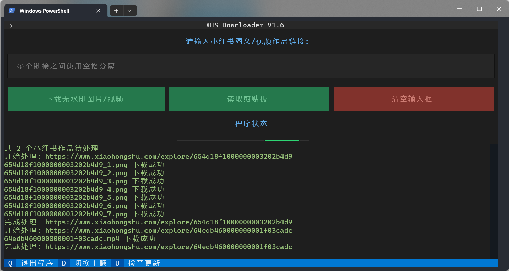
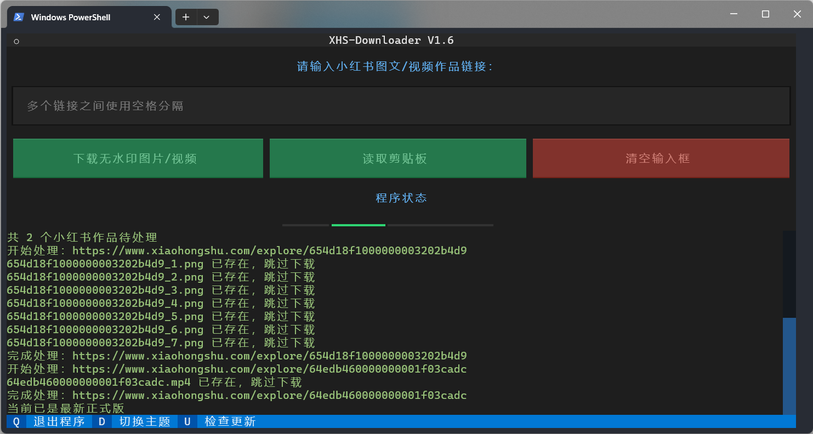

 
<h1>XHS-Downloader</h1>

<h1>📑 功能清单</h1>
<ul>
<li>✅ 采集小红书图文/视频作品信息</li>
<li>✅ 提取小红书图文/视频作品文件下载地址</li>
<li>✅ 下载小红书无水印图文/视频作品文件</li>
<li>✅ 自动跳过已下载的作品文件</li>
<li>✅ 作品文件完整性处理机制</li>
<li>☑️ 采集作品信息储存至文件</li>
</ul>
<h1>📸 程序截图</h1>
 

<h1>🔗 支持链接</h1>
<ul>
<li><code>https://www.xiaohongshu.com/explore/作品ID</code></li>
<li><code>https://www.xiaohongshu.com/discovery/item/作品ID</code></li>
<li><code>https://xhslink.com/分享码</code></li>
 

<b>支持单次输入多个作品链接，链接之间使用空格分隔。</b>

</ul>
<h1>🪟 关于终端</h1>

⭐ 推荐使用 <a href="https://learn.microsoft.com/zh-cn/windows/terminal/install">Windows 终端</a> （Windows 11 自带默认终端）运行程序以便获得最佳显示效果！

<h1>🥣 使用方法</h1>

如果仅需下载作品文件，选择 <b>直接运行</b> 或者 <b>源码运行</b> 均可，如果需要获取作品信息，则需要进行二次开发进行调用。

<h2>🖱 直接运行</h2>

前往 <a href="https://github.com/JoeanAmier/XHS-Downloader/releases/latest">Releases</a> 下载程序压缩包，解压后打开程序文件夹，双击运行 <code>main.exe</code> 即可使用。

<h2>⌨️ 源码运行</h2>
<ol>
<li>安装版本号不低于 <code>3.12</code> 的 Python 解释器</li>
<li>运行 <code>pip install -r requirements.txt</code> 命令安装程序所需模块</li>
<li>下载本项目最新的源码或 <a href="https://github.com/JoeanAmier/XHS-Downloader/releases/latest">Releases</a> 发布的源码至本地</li>
<li>运行 <code>main.py</code> 即可使用</li>
</ol>
<h2>💻 二次开发</h2>

如果需要获取小红书图文/视频作品信息，可以根据 <code>main.py</code> 的注释提示进行代码调用。

<pre>
# 测试链接
error_demo = "https://github.com/JoeanAmier/XHS_Downloader"
image_demo = "https://www.xiaohongshu.com/explore/63b275a30000000019020185"
video_demo = "https://www.xiaohongshu.com/explore/64edb460000000001f03cadc"
multiple_demo = f"{image_demo} {video_demo}"
# 实例对象
path = ""  # 作品数据/文件保存根路径，默认值：项目根路径
folder_name = "Download"  # 作品文件储存文件夹名称（自动创建），默认值：Download
user_agent = ""  # 请求头 User-Agent
proxy = ""  # 网络代理
timeout = 5  # 网络请求超时限制，单位：秒，默认值：10
chunk = 1024 * 1024  # 下载文件时，每次从服务器获取的数据块大小，单位：字节
max_retry = 2  # 请求数据失败时，重试的最大次数，单位：秒，默认值：5
# async with XHS() as xhs:
#     pass  # 使用默认参数
async with XHS(path=path,
               folder_name=folder_name,
               user_agent=user_agent,
               proxy=proxy,
               timeout=timeout,
               chunk=chunk,
               max_retry=max_retry, ) as xhs:  # 使用自定义参数
    download = True  # 是否下载作品文件，默认值：False
    # 返回作品详细信息，包括下载地址
    print(await xhs.extract(error_demo, download))  # 获取数据失败时返回空字典
    print(await xhs.extract(image_demo, download))
    print(await xhs.extract(video_demo, download))
    print(await xhs.extract(multiple_demo, download))  # 支持传入多个作品链接
</pre>
<h1>⚙️ 配置文件</h1>

项目根目录下的 <code>settings.json</code> 文件，首次运行自动生成，可以自定义部分运行参数。

<table>
<thead>
<tr>
<th align="center">参数</th>
<th align="center">类型</th>
<th align="center">含义</th>
<th align="center">默认值</th>
</tr>
</thead>
<tbody>
<tr>
<td align="center">path</td>
<td align="center">str</td>
<td align="center">作品数据 / 文件保存根路径</td>
<td align="center">项目根路径</td>
</tr>
<tr>
<td align="center">folder_name</td>
<td align="center">str</td>
<td align="center">作品文件储存文件夹名称</td>
<td align="center">Download</td>
</tr>
<tr>
<td align="center">user_agent</td>
<td align="center">str</td>
<td align="center">请求头 User-Agent</td>
<td align="center">默认 UA</td>
</tr>
<tr>
<td align="center">proxy</td>
<td align="center">str</td>
<td align="center">设置代理</td>
<td align="center">无</td>
</tr>
<tr>
<td align="center">timeout</td>
<td align="center">int</td>
<td align="center">请求数据超时限制，单位：秒</td>
<td align="center">10</td>
</tr>
<tr>
<td align="center">chunk</td>
<td align="center">int</td>
<td align="center">下载文件时，每次从服务器获取的数据块大小，单位：字节</td>
<td align="center">1048576(1 MB)</td>
</tr>
<tr>
<td align="center">max_retry</td>
<td align="center">int</td>
<td align="center">请求数据失败时，重试的最大次数，单位：秒</td>
<td align="center">5</td>
</tr>
</tbody>
</table>
<h1>♥️ 支持项目</h1>

如果 <b>XHS-Downloader</b> 对您有帮助，请考虑为它点个 <b>Star</b> ⭐，感谢您的支持！

<table>
<thead>
<tr>
<th align="center">微信(WeChat)</th>
<th align="center">支付宝(Alipay)</th>
</tr>
</thead>
<tbody><tr>
<td align="center"></td>
<td align="center"></td>
</tr>
</tbody>
</table>

如果您愿意，可以考虑提供资助为 <b>XHS-Downloader</b> 提供额外的支持！

<h1>✉️ 联系作者</h1>
<ul>
<li>QQ: 2437596031（联系请说明来意）</li>
<li>QQ Group: <a href="https://github.com/JoeanAmier/XHS-Downloader/blob/master/static/QQ%E7%BE%A4%E8%81%8A%E4%BA%8C%E7%BB%B4%E7%A0%81.png">点击扫码加入群聊</a></li>
<li>Email: yonglelolu@gmail.com</li>
</ul>

<b>XHS-Downloader 是我个人独立维护的一个开源项目，鉴于个人精力有限，请理解项目进展可能较为缓慢，我会尽力保持更新和维护，以确保项目的稳定性和功能的不断改进。</b>

<b>如果您通过 Email 联系我，我可能无法及时查看并回复信息，我会尽力在七天内回复您的邮件；如果有紧急事项或需要更快的回复，请通过其他方式与我联系，谢谢理解！</b>

<b>如果您对抖音 / TikTok 感兴趣，可以了解一下我的另一个开源项目 <a href="https://github.com/JoeanAmier/TikTokDownloader">TikTokDownloader</a></b>

<h1>⚠️ 免责声明</h1>
<ul>
<li>使用者对本项目的使用由使用者自行决定，并自行承担风险。作者对使用者使用本项目所产生的任何损失、责任、或风险概不负责。</li>
<li>本项目的作者提供的代码和功能是基于现有知识和技术的开发成果。作者尽力确保代码的正确性和安全性，但不保证代码完全没有错误或缺陷。</li>
<li>使用者在使用本项目时必须严格遵守 <a href="https://github.com/JoeanAmier/XHS-Downloader/blob/master/LICENSE">GNU
    General Public License v3.0</a> 的要求，并在适当的地方注明使用了 <a
        href="https://github.com/JoeanAmier/XHS-Downloader/blob/master/LICENSE">GNU General Public License
    v3.0</a> 的代码。
</li>
<li>使用者在任何情况下均不得将本项目的作者、贡献者或其他相关方与使用者的使用行为联系起来，或要求其对使用者使用本项目所产生的任何损失或损害负责。</li>
<li>使用者在使用本项目的代码和功能时，必须自行研究相关法律法规，并确保其使用行为合法合规。任何因违反法律法规而导致的法律责任和风险，均由使用者自行承担。</li>
<li>本项目的作者不会提供 XHS-Downloader 项目的付费版本，也不会提供与 XHS-Downloader 项目相关的任何商业服务。</li>
<li>基于本项目进行的任何二次开发、修改或编译的程序与原创作者无关，原创作者不承担与二次开发行为或其结果相关的任何责任，使用者应自行对因二次开发可能带来的各种情况负全部责任。</li>
</ul>
<b>在使用本项目的代码和功能之前，请您认真考虑并接受以上免责声明。如果您对上述声明有任何疑问或不同意，请不要使用本项目的代码和功能。如果您使用了本项目的代码和功能，则视为您已完全理解并接受上述免责声明，并自愿承担使用本项目的一切风险和后果。</b>
