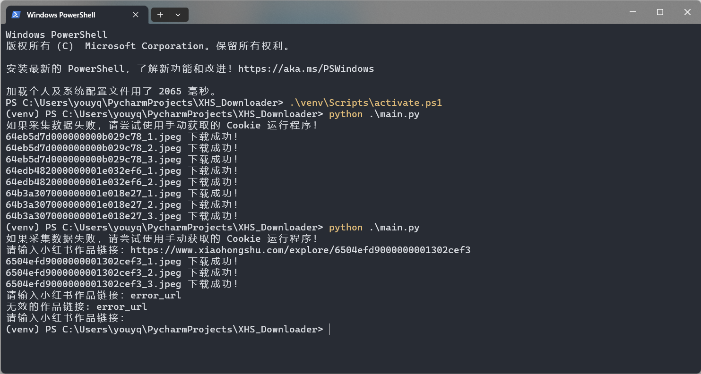

 
<h1>小红书作品采集工具</h1>

<b><code>2023/9/11</code>：<del>因小红书更新，无水印图片采集功能失效！</del></b>

<b><code>2023/9/14</code>：已修复无水印图片采集功能！</b>

<h1>📝 功能清单</h1>
<ul>
<li>采集小红书图文/视频作品信息</li>
<li>获取小红书图文/视频作品下载地址</li>
<li>下载小红书图文/视频作品文件</li>
<li>自动跳过已存在的作品文件</li>
<li>作品文件完整性处理机制</li>
<li>批量下载小红书作品文件</li>
</ul>
<h1>📸 程序截图</h1>
 

<h1>🥣 使用方法</h1>

如果仅需下载作品文件，选择 <b>直接运行</b> 或者 <b>源码运行</b> 均可，如果需要获取作品信息，则需要进行二次开发进行调用。

<h2>🖱 直接运行</h2>

前往 Releases 下载程序压缩包，解压后打开程序文件夹，双击运行 <code>main.exe</code> 即可使用。

<h2>⌨️ 源码运行</h2>
<ol>
<li>安装版本号不低于 <code>3.10</code> 的 Python 解释器</li>
<li>安装 <code>requirements.txt</code> 包含的第三方模块</li>
<li>下载本项目最新的源码或 <code>Releases</code> 发布的源码至本地</li>
<li>运行 <code>main.py</code> 即可使用</li>
</ol>
<h2>💻 二次开发</h2>

如果想要获取小红书图文/视频作品信息，可以根据 <code>main.py</code> 的注释提示进行代码调用。

<pre>
# 测试链接
error_demo = "https://github.com/JoeanAmier/XHS_Downloader"
image_demo = "https://www.xiaohongshu.com/explore/63b275a30000000019020185"
video_demo = "https://www.xiaohongshu.com/explore/64edb460000000001f03cadc"
# 实例对象
path = ""  # 作品下载储存根路径，默认值：当前路径
folder = "Download"  # 作品下载文件夹名称（自动创建），默认值：Download
cookie = ""  # 小红书网页版 Cookie
proxies = None  # 网络代理
timeout = 5  # 网络请求超时限制，默认值：10
chunk = 1024 * 1024  # 下载文件时，每次从服务器获取的数据块大小，单位字节
xhs = XHS(
    path=path,
    folder=folder,
    cookie=cookie,
    proxies=proxies,
    timeout=timeout,
    chunk=chunk, )  # 使用自定义参数
# xhs = XHS()  # 使用默认参数
download = True  # 是否下载作品文件
# 返回作品详细信息，包括下载地址
print(xhs.extract(error_demo))  # 获取数据失败时返回空字典
print(xhs.extract(image_demo, download=download))
print(xhs.extract(video_demo, download=download))
</pre>
<h1>⛓ 批量下载</h1>

在程序当前文件夹创建一个 <code>xhs.txt</code> 文本文件，然后将待处理的作品链接输入文件，每行输入一个作品链接，编辑完成后保存文件，然后运行程序，程序会自动读取 <code>xhs.txt</code> 文件内容，并批量下载每个作品的文件，下载完成后需要手动删除 <code>xhs.txt</code> 文件。

<h1>⚙️ 配置文件</h1>

根目录下的 <code>settings.json</code> 文件，可以自定义部分运行参数。

<table>
<thead>
<tr>
<th align="center">参数</th>
<th align="center">类型</th>
<th align="center">含义</th>
<th align="center">默认值</th>
</tr>
</thead>
<tbody>
<tr>
<td align="center">path</td>
<td align="center">str</td>
<td align="center">文件储存根路径</td>
<td align="center">项目根路径</td>
</tr>
<tr>
<td align="center">folder</td>
<td align="center">str</td>
<td align="center">文件储存文件夹名称</td>
<td align="center">Download</td>
</tr>
<tr>
<td align="center">cookie</td>
<td align="center">str</td>
<td align="center">小红书网页版 Cookie，无需登录</td>
<td align="center">内置 Cookie，可能会失效，建议自行设置</td>
</tr>
<tr>
<td align="center">proxies</td>
<td align="center">str</td>
<td align="center">设置代理</td>
<td align="center">无</td>
</tr>
<tr>
<td align="center">timeout</td>
<td align="center">int</td>
<td align="center">请求数据超时限制，单位：秒</td>
<td align="center">10</td>
</tr>
<tr>
<td align="center">chunk</td>
<td align="center">int</td>
<td align="center">下载文件时，每次从服务器获取的数据块大小，单位：字节</td>
<td align="center">262144(256KB)</td>
</tr>
</tbody>
</table>
<h1>⚠️ 免责声明</h1>
<ul>
<li>使用者对本项目的使用由使用者自行决定，并自行承担风险。作者对使用者使用本项目所产生的任何损失、责任、或风险概不负责。</li>
<li>本项目的作者提供的代码和功能是基于现有知识和技术的开发成果。作者尽力确保代码的正确性和安全性，但不保证代码完全没有错误或缺陷。</li>
<li>使用者在使用本项目时必须严格遵守 <a href="https://github.com/JoeanAmier/XHS_Downloader/blob/master/LICENSE">GNU
    General Public License v3.0</a> 的要求，并在适当的地方注明使用了 <a
        href="https://github.com/JoeanAmier/XHS_Downloader/blob/master/LICENSE">GNU General Public License
    v3.0</a> 的代码。
</li>
<li>使用者在任何情况下均不得将本项目的作者、贡献者或其他相关方与使用者的使用行为联系起来，或要求其对使用者使用本项目所产生的任何损失或损害负责。</li>
<li>使用者在使用本项目的代码和功能时，必须自行研究相关法律法规，并确保其使用行为合法合规。任何因违反法律法规而导致的法律责任和风险，均由使用者自行承担。</li>
<li>基于本项目进行的任何二次开发、修改或编译的程序与原创作者无关，原创作者不承担与二次开发行为或其结果相关的任何责任，使用者应自行对因二次开发可能带来的各种情况负全部责任。</li>
</ul>
<b>在使用本项目的代码和功能之前，请您认真考虑并接受以上免责声明。如果您对上述声明有任何疑问或不同意，请不要使用本项目的代码和功能。如果您使用了本项目的代码和功能，则视为您已完全理解并接受上述免责声明，并自愿承担使用本项目的一切风险和后果。</b>
