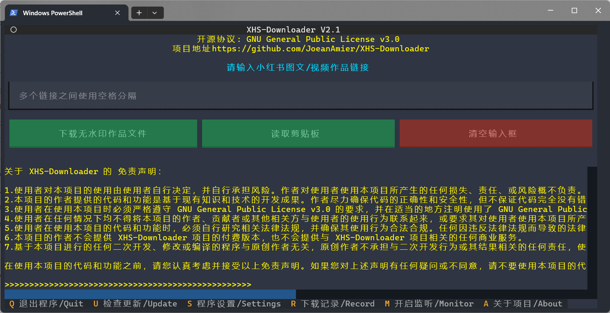
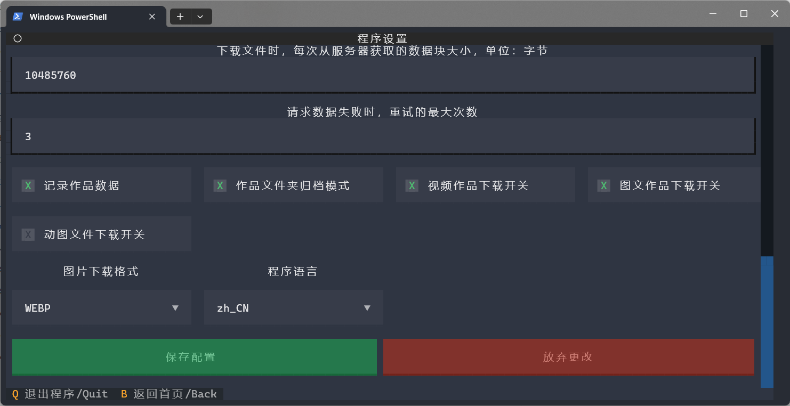
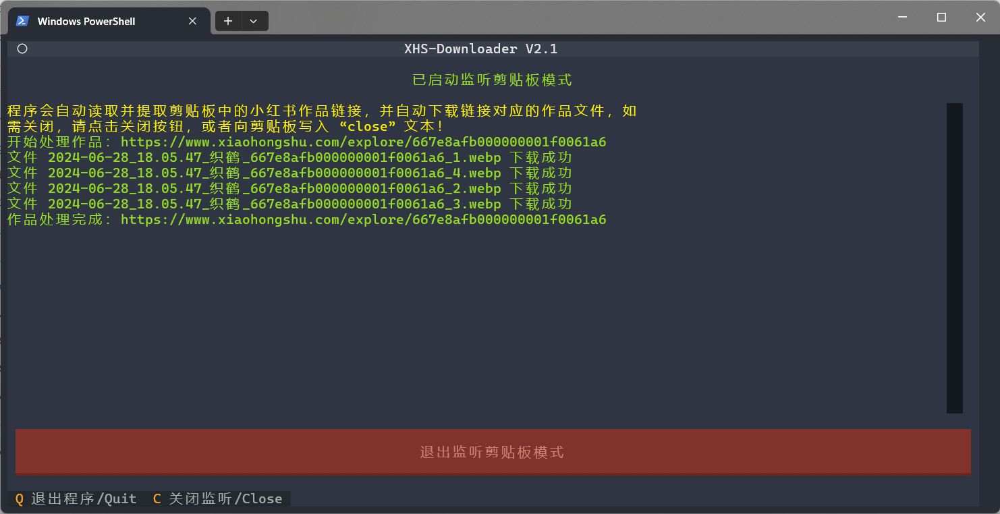

 
<h1>XHS-Downloader</h1>

简体中文 | <a href="README_EN.md">English</a>

 

 

 

🔥 <b>小红书链接提取/作品采集工具</b>：提取账号发布、收藏、点赞、专辑作品链接；提取搜索结果作品链接、用户链接；采集小红书作品信息；提取小红书作品下载地址；下载小红书无水印作品文件！

🔥 “小红书”、“XiaoHongShu”、“RedNote” 含义相同，本项目统称为 “小红书”

<h1>📑 项目功能</h1>

项目程序与用户脚本功能清单（点击展开）

<ul><b>程序功能</b>
<li>✅ 采集小红书作品信息</li>
<li>✅ 提取小红书作品下载地址</li>
<li>✅ 下载小红书无水印作品文件</li>
<li>✅ 下载小红书 livePhoto 文件(含水印)</li>
<li>✅ 自动跳过已下载的作品文件</li>
<li>✅ 作品文件完整性处理机制</li>
<li>✅ 自定义图文作品文件下载格式</li>
<li>✅ 持久化储存作品信息至文件</li>
<li>✅ 作品文件储存至单独文件夹</li>
<li>✅ 后台监听剪贴板下载作品</li>
<li>✅ 记录已下载作品 ID</li>
<li>✅ 支持命令行下载作品文件</li>
<li>✅ 从浏览器读取 Cookie</li> 
<li>✅ 自定义文件名称格式</li> 
<li>✅ 支持 API 调用功能</li>
<li>✅ 支持 MCP 调用功能</li>
<li>✅ 支持文件断点续传下载</li>
<li>✅ 智能识别作品文件类型</li>
<li>✅ 支持设置作者备注</li>
<li>✅ 自动更新作者昵称</li>
</ul>
<ul><a href="#user-scripts"><b>脚本功能</b></a>
<li>✅ 下载小红书无水印作品文件</li>
<li>✅ 提取推荐页面作品链接</li>
<li>✅ 提取账号发布作品链接</li>
<li>✅ 提取账号收藏作品链接</li>
<li>✅ 提取账号点赞作品链接</li>
<li>✅ 提取账号专辑作品链接</li>
<li>✅ 提取搜索结果作品链接</li>
<li>✅ 提取搜索结果用户链接</li>
</ul>

<h1>📸 程序截图</h1>

<a href="https://www.bilibili.com/video/BV1Fcb3zWEjt/">前往 bilibili 观看演示</a>；<a href="https://youtu.be/VIjDytHaopg">前往 YouTube 观看演示</a>

<h1>🔗 支持链接</h1>
<ul>
<li><code>https://www.xiaohongshu.com/explore/作品ID?xsec_token=XXX</code></li>
<li><code>https://www.xiaohongshu.com/discovery/item/作品ID?xsec_token=XXX</code></li>
<li><code>https://www.xiaohongshu.com/user/profile/作者ID/作品ID?xsec_token=XXX</code></li>
<li><code>https://xhslink.com/分享码</code></li>
 

<b>支持单次输入多个作品链接，链接之间使用空格分隔；程序会自动提取有效链接，无需额外处理！</b>

</ul>
<h1>🪟 关于终端</h1>

⭐ 推荐使用 <a href="https://learn.microsoft.com/zh-cn/windows/terminal/install">Windows 终端</a> （Windows 11 默认终端）运行程序以便获得最佳显示效果！

<h1>🥣 使用方法</h1>

如果仅需下载无水印作品文件，建议选择 <b>程序运行</b> 或 <b>Docker 运行</b>；如果有其他需求，建议选择 <b>源码运行</b>！

<code>2.2</code> 版本开始，项目功能无异常的情况下，无需额外处理 Cookie！

<h2>🖱 程序运行</h2>

⭐ Mac OS、Windows 10 及以上用户可前往 <a href="https://github.com/JoeanAmier/XHS-Downloader/releases/latest">Releases</a> 或者 <a href="https://github.com/JoeanAmier/XHS-Downloader/actions">Actions</a> 下载程序压缩包，解压后打开程序文件夹，双击运行 <code>main</code> 即可使用。

⭐ 本项目包含自动构建可执行文件的 GitHub Actions，使用者可以随时使用 GitHub Actions 将最新源码构建为可执行文件！

⭐ 自动构建可执行文件教程请查阅本文档的 <code>构建可执行文件指南</code> 部分；如果需要更加详细的图文教程，请 <a href="https://mp.weixin.qq.com/s/TorfoZKkf4-x8IBNLImNuw">查阅文章</a>！

<strong>注意：由于 Mac OS 平台的可执行文件 <code>main</code> 未经过代码签名，首次运行时会受到系统安全限制。请先在终端执行 <code>xattr -cr 项目文件夹路径</code> 命令移除安全标记，执行一次后即可正常运行。</strong>

若通过此方式使用程序，文件默认下载路径为：<code>.\_internal\Volume\Download</code>；配置文件路径为：<code>.\_internal\Volume\settings.json</code>

<h3>程序更新</h3>

<strong>方案一：</strong>下载并解压文件，将旧版本的 <code>_internal\Volume</code> 文件夹复制到新版本的 <code>_internal</code> 文件夹。

<strong>方案二：</strong>下载并解压文件（不要运行程序），复制全部文件，直接覆盖旧版本文件。

<h2>⌨️ 源码运行</h2>
<ol>
<li>安装 <code>3.12</code> 版本的 <a href="https://www.python.org/">Python</a> 解释器</li>
<li>下载最新的源码或 <a href="https://github.com/JoeanAmier/XHS-Downloader/releases/latest">Releases</a> 发布的源码至本地</li>
<ol><b>使用 pip 安装项目依赖</b>
<li>运行 <code>python -m venv venv</code> 命令创建虚拟环境（可选）</li>
<li>运行 <code>.\venv\Scripts\activate.ps1</code> 或者 <code>venv\Scripts\activate</code> 命令激活虚拟环境（可选）</li>
<li>运行 <code>pip install -i https://pypi.tuna.tsinghua.edu.cn/simple -r requirements.txt</code> 命令安装程序所需模块</li>
<li>运行 <code>python .\main.py</code> 或者 <code>python main.py</code> 命令启动 XHS-Downloader</li>
</ol>
<ol><b>使用 uv 安装项目依赖（推荐）</b>
<li>运行 <code>uv venv</code> 命令创建虚拟环境</li>
<li>运行 <code>uv sync</code> 命令同步环境依赖</li>
<li>运行 <code>uv run main.py</code> 命令启动 XHS-Downloader</li>
</ol>
</ol>
<h2>⌨️ Docker 运行</h2>
<ol>
<li>获取镜像</li>
<ul>
<li>方式一：使用 <code>Dockerfile</code> 文件构建镜像</li>
<li>方式二：使用 <code>docker pull joeanamier/xhs-downloader</code> 命令拉取镜像</li>
<li>方式三：使用 <code>docker pull ghcr.io/joeanamier/xhs-downloader</code> 命令拉取镜像</li>
</ul>
<li>创建容器</li>
<ul>
<li>TUI 模式：<code>docker run --name 容器名称(可选) -p 主机端口号:5556 -v xhs_downloader_volume:/app/Volume -it &lt;镜像名称&gt;</code></li>
<li>API 模式：<code>docker run --name 容器名称(可选) -p 主机端口号:5556 -v xhs_downloader_volume:/app/Volume -it &lt;镜像名称&gt; python main.py api</code></li>
<li>MCP 模式：<code>docker run --name 容器名称(可选) -p 主机端口号:5556 -v xhs_downloader_volume:/app/Volume -it &lt;镜像名称&gt; python main.py mcp</code></li>
 <b>注意：</b>此处的 <code>&lt;镜像名称&gt;</code> 需与您在第一步中使用的镜像名称保持一致（<code>joeanamier/xhs-downloader</code> 或 <code>ghcr.io/joeanamier/xhs-downloader</code>）
</ul>
<li>运行容器
<ul>
<li>启动容器：<code>docker start -i 容器名称/容器 ID</code></li>
<li>重启容器：<code>docker restart -i 容器名称/容器 ID</code></li>
</ul>
</li>
</ol>

Docker 运行项目时不支持 <b>命令行调用模式</b>，无法使用 <b>读取剪贴板</b> 与 <b>监听剪贴板</b> 功能，可以正常粘贴内容，其他功能如有异常请反馈！

<h1>🛠 命令行模式</h1>

项目支持命令行运行模式，若想要下载图文作品的部分图片，可以使用此模式设置需要下载的图片序号！

<strong>注意：</strong>未设置 <code>--index</code> 参数时，支持传入多个作品链接，全部链接需要使用引号包围，链接之间使用空格分隔；已设置 <code>--index</code> 参数时，不支持传入多个作品链接，即使传入多个作品链接，程序仅处理首个作品链接！

<code>bool</code> 类型参数支持使用 <code>true</code>、<code>false</code>、<code>1</code>、<code>0</code>、<code>yes</code>、<code>no</code>、<code>on</code> 或 <code>off</code>（不区分大小写）来设置。

<h2>从浏览器读取 Cookie</h2>

可以使用命令行实现 <b>从浏览器读取 Cookie 并写入配置文件！</b>

命令示例：<code>python .\main.py --browser_cookie Chrome --update_settings</code>

兼容性提醒：此功能依赖的第三方模块已长期未更新，可能无法正常支持最新浏览器版本。若功能出现异常，请尝试手动获取 Cookie！

<h1>🖥 服务器模式</h1>

服务器模式包含 API 模式和 MCP 模式！

<h2>API 模式</h2>

<b>启动：</b>运行命令：<code>python .\main.py api</code>

<b>关闭：</b>按下 <code>Ctrl</code> + <code>C</code> 关闭服务器

访问 <code>http://127.0.0.1:5556/docs</code> 或者 <code>http://127.0.0.1:5556/redoc</code>；你会看到自动生成的交互式 API 文档！

<b>请求接口：</b><code>/xhs/detail</code>

<b>请求方法：</b><code>POST</code>

<b>请求格式：</b><code>JSON</code>

<b>请求参数：</b>

<table>
<thead>
<tr>
<th align="center">参数</th>
<th align="center">类型</th>
<th align="center">含义</th>
<th align="center">默认值</th>
</tr>
</thead>
<tbody>
<tr>
<td align="center">url</td>
<td align="center">str</td>
<td align="center">小红书作品链接，自动提取，不支持多链接；必需参数</td>
<td align="center">无</td>
</tr>
<tr>
<td align="center">download</td>
<td align="center">bool</td>
<td align="center">是否下载作品文件；设置为 <code>true</code> 将会耗费更多时间；可选参数</td>
<td align="center">false</td>
</tr>
<tr>
<td align="center">index</td>
<td align="center">list[int]</td>
<td align="center">下载指定序号的图片文件，仅对图文作品生效；<code>download</code> 参数设置为 <code>false</code> 时不生效；可选参数</td>
<td align="center">null</td>
</tr>
<tr>
<td align="center">cookie</td>
<td align="center">str</td>
<td align="center">请求数据时使用的 Cookie；可选参数</td>
<td align="center">配置文件 cookie 参数</td>
</tr>
<tr>
<td align="center">proxy</td>
<td align="center">str</td>
<td align="center">请求数据时使用的代理；可选参数</td>
<td align="center">配置文件 proxy 参数</td>
</tr>
<tr>
<td align="center">skip</td>
<td align="center">bool</td>
<td align="center">是否跳过存在下载记录的作品；设置为 <code>true</code> 将不会返回存在下载记录的作品数据；可选参数</td>
<td align="center">false</td>
</tr>
</tbody>
</table>

<b>代码示例：</b>

<pre>
async def example_api():
    """通过 API 设置参数，适合二次开发"""
    server = "http://127.0.0.1:5556/xhs/detail"
    data = {
        "url": "",  # 必需参数
        "download": True,
        "index": [
            3,
            6,
            9,
        ],
        "proxy": "http://127.0.0.1:10808",
    }
    response = post(server, json=data, timeout=10)
    print(response.json())
</pre>
<h2>MCP 模式</h2>

<b>启动：</b>运行命令：<code>python .\main.py mcp</code>

<b>关闭：</b>按下 <code>Ctrl</code> + <code>C</code> 关闭服务器

<h3>MCP 配置示例</h3>

[//]: # (<h4>STDIO</h4>)
<h4>Streamable HTTP</h4>

<b>MCP URL：</b><code>http://127.0.0.1:5556/mcp/</code>

<h3>MCP 调用示例</h3>

MCP 功能及调用示例（点击展开）

<h4><strong>获取小红书作品信息</strong></h4>

<h4><strong>下载小红书作品文件</strong></h4>

下载图文作品时可以指定需要下载的图片序号；默认不返回作品信息，如需返回作品信息，请在对话时明确表述。

<h1>📜 其他说明</h1>
<ul>
<li>由于作品链接携带日期信息，使用先前日期获取的作品链接可能会被风控，建议下载作品文件时使用最新获取的作品链接</li>
<li>Windows 系统需要以管理员身份运行程序才能读取 Chromium、Chrome、Edge 浏览器 Cookie</li>
<li>如果开启保存作品数据至文件功能，作品数据默认储存至 <code>./Volume/Download/ExploreData.db</code> 文件</li>
<li>程序下载记录数据储存至 <code>./Volume/ExploreID.db</code> 文件</li>
<li>为了避免请求频率过高对平台服务器造成影响，本项目内置请求延时机制</li>
</ul>
<h1 id="user-scripts">🕹 用户脚本</h1>

如果您的浏览器安装了 <a href="https://www.tampermonkey.net/">Tampermonkey</a> 浏览器扩展程序，可以使用用户脚本体验项目功能！

用户脚本链接（右键单击复制链接）：<a href="https://raw.githubusercontent.com/JoeanAmier/XHS-Downloader/refs/heads/master/static/XHS-Downloader.js">master 分支</a>、<a href="https://raw.githubusercontent.com/JoeanAmier/XHS-Downloader/refs/heads/develop/static/XHS-Downloader.js">develop 分支</a>

查看 Tampermonkey 用户脚本截图（点击展开）

提示：使用 XHS-Downloader 用户脚本批量提取作品链接，搭配 XHS-Downloader 程序可以实现批量下载无水印作品文件！

<h2>🌏 连接服务器</h2>

⭐ 本项目支持通过浏览器用户脚本与主程序联动，实现一键推送下载任务。

<ul><b>功能说明：</b>
<li>在项目程序的配置文件中，需要将 <code>script_server</code> 参数设置为 <code>true</code></li>
<li>保持项目程序在后台运行，它将作为服务器，接收用户脚本的指令（TUI、MCP 和 API 模式均支持）</li>
<li>当您在浏览器中访问作品页面时，点击用户脚本菜单中的 <code>推送下载任务</code> 选项</li>
<li>用户脚本会将下载任务发送给项目程序，由项目程序负责处理和下载文件</li>
</ul>
<h2>📜 脚本说明</h2>
<ul>
<li>下载小红书无水印作品文件时，脚本需要花费时间处理文件，请等待片刻，请勿多次点击下载按钮</li>
<li>无水印图片文件为 PNG 格式；无水印视频文件较大，可能需要较长的时间处理，页面跳转可能会导致下载失败</li>
<li>提取账号发布、收藏、点赞、专辑作品链接时，脚本可以自动滚动页面直至加载全部作品</li>
<li>提取推荐作品链接、搜索作品、用户链接时，脚本可以自动滚动指定次数加载更多内容，默认滚动次数：50 次</li>
<li>自动滚动页面功能默认关闭；用户可以自由开启，并修改滚动页面次数，修改后立即生效</li>
<li>如果未开启自动滚动页面功能，用户需要手动滚动页面以便加载更多内容后再进行其他操作</li>
<li>支持作品文件打包下载；该功能默认开启，多个文件的作品将会以压缩包格式下载</li>
<li>使用全局代理工具可能会导致脚本下载文件失败，如有异常，请尝试关闭代理工具，必要时向作者反馈</li>
<li>XHS-Downloader 用户脚本仅实现可见即可得的数据采集功能，无任何收费功能和破解功能</li>
</ul>

<strong>自动滚动页面功能代码已重构，该功能默认关闭！启用该功能可能会被小红书检测为自动化操作，从而导致账号受到风控或封禁风险！</strong>

<h1>💻 二次开发</h1>

如果有其他需求，可以根据 <code>example.py</code> 的注释提示进行代码调用或修改！

<pre>
async def example():
    """通过代码设置参数，适合二次开发"""
    # 示例链接
    demo_link = "https://www.xiaohongshu.com/explore/XXX?xsec_token=XXX"
    # 实例对象
    work_path = "D:\\"  # 作品数据/文件保存根路径，默认值：项目根路径
    folder_name = "Download"  # 作品文件储存文件夹名称（自动创建），默认值：Download
    name_format = "作品标题 作品描述"
    user_agent = ""  # User-Agent
    cookie = ""  # 小红书网页版 Cookie，无需登录，可选参数，登录状态对数据采集有影响
    proxy = None  # 网络代理
    timeout = 5  # 请求数据超时限制，单位：秒，默认值：10
    chunk = 1024 * 1024 * 10  # 下载文件时，每次从服务器获取的数据块大小，单位：字节
    max_retry = 2  # 请求数据失败时，重试的最大次数，单位：秒，默认值：5
    record_data = False  # 是否保存作品数据至文件
    image_format = "WEBP"  # 图文作品文件下载格式，支持：AUTO、PNG、WEBP、JPEG、HEIC
    folder_mode = False  # 是否将每个作品的文件储存至单独的文件夹
    image_download = True  # 图文、图集作品文件下载开关
    video_download = True  # 视频作品文件下载开关
    live_download = False  # 图文动图文件下载开关
    download_record = True  # 是否记录下载成功的作品 ID
    language = "zh_CN"  # 设置程序提示语言
    author_archive = True  # 是否将每个作者的作品存至单独的文件夹
    write_mtime = True  # 是否将作品文件的 修改时间 修改为作品的发布时间
    read_cookie = None  # 读取浏览器 Cookie，支持设置浏览器名称（字符串）或者浏览器序号（整数），设置为 None 代表不读取
    # async with XHS() as xhs:
    #     pass  # 使用默认参数
    async with XHS(
        work_path=work_path,
        folder_name=folder_name,
        name_format=name_format,
        user_agent=user_agent,
        cookie=cookie,
        proxy=proxy,
        timeout=timeout,
        chunk=chunk,
        max_retry=max_retry,
        record_data=record_data,
        image_format=image_format,
        folder_mode=folder_mode,
        image_download=image_download,
        video_download=video_download,
        live_download=live_download,
        download_record=download_record,
        language=language,
        read_cookie=read_cookie,
        author_archive=author_archive,
        write_mtime=write_mtime,
    ) as xhs:  # 使用自定义参数
        download = True  # 是否下载作品文件，默认值：False
        # 返回作品详细信息，包括下载地址
        # 获取数据失败时返回空字典
        print(
            await xhs.extract(
                demo_link,
                download,
                index=[
                    1,
                    2,
                    5,
                ],
            )
        )
</pre>
<h1>📋 读取剪贴板</h1>

项目使用 <code>pyperclip</code> 实现读取剪贴板功能，该模块在不同的系统上会有差异。

在 Windows 上，不需要额外的模块。

在 Mac 上，该模块使用 pbcopy 和 pbpaste 命令，这些命令应该随操作系统一起提供。

在 Linux 上，该模块使用 xclip 或 xsel 命令，这些命令应该随操作系统一起提供。否则，请运行 "sudo apt-get install xclip" 或 "sudo apt-get install xsel"（注意：xsel 似乎并不总是有效）

在其他 Linux 系统上，你需要安装 qtpy 或 PyQT5 模块。

<h1>⚙️ 配置文件</h1>

项目根目录下的 <code>./Volume/settings.json</code> 文件，首次运行自动生成，可以自定义程序运行参数；如果设置了无效的参数值，程序将会使用参数默认值！

如果您在程序界面修改配置时无法正常交互，可以直接编辑配置文件；如果您的计算机没有合适的程序编辑 JSON 文件，建议使用 <a href="https://www.toolhelper.cn/JSON/JSONFormat">在线工具</a> 编辑配置文件内容，修改后需要重启软件才能生效。

<table>
<thead>
<tr>
<th align="center">参数</th>
<th align="center">类型</th>
<th align="center">含义</th>
<th align="center">默认值</th>
</tr>
</thead>
<tbody>
<tr>
<td align="center">mapping_data</td>
<td align="center">str: str</td>
<td align="center"><a href="#author_archive">#</a>作者别名映射表，格式：<code>作者ID: 作者别名</code></td>
<td align="center">无</td>
</tr>
<tr>
<td align="center">work_path</td>
<td align="center">str</td>
<td align="center">作品数据 / 文件保存根路径</td>
<td align="center">项目根路径/Volume</td>
</tr>
<tr>
<td align="center">folder_name</td>
<td align="center">str</td>
<td align="center">作品文件储存文件夹名称</td>
<td align="center">Download</td>
</tr>
<tr>
<td align="center">name_format</td>
<td align="center">str</td>
<td align="center">作品文件名称格式，字段之间使用空格分隔，支持字段：<code>收藏数量</code>、<code>评论数量</code>、<code>分享数量</code>、<code>点赞数量</code>、<code>作品标签</code>、<code>作品ID</code>、<code>作品标题</code>、<code>作品描述</code>、<code>作品类型</code>、<code>发布时间</code>、<code>最后更新时间</code>、<code>作者昵称</code>、<code>作者ID</code></td>
<td align="center"><code>发布时间 作者昵称 作品标题</code></td>
</tr>
<tr>
<td align="center">user_agent</td>
<td align="center">str</td>
<td align="center">浏览器 User Agent</td>
<td align="center">内置 Chrome User Agent</td>
</tr>
<tr>
<td align="center">cookie</td>
<td align="center">str</td>
<td align="center">小红书网页版 Cookie，<b>无需登录，非必需参数！</b></td>
<td align="center">无</td>
</tr>
<tr>
<td align="center">proxy</td>
<td align="center">str</td>
<td align="center">设置程序代理</td>
<td align="center">null</td>
</tr>
<tr>
<td align="center">timeout</td>
<td align="center">int</td>
<td align="center">请求数据超时限制，单位：秒</td>
<td align="center">10</td>
</tr>
<tr>
<td align="center">chunk</td>
<td align="center">int</td>
<td align="center">下载文件时，每次从服务器获取的数据块大小，单位：字节</td>
<td align="center">2097152(2 MB)</td>
</tr>
<tr>
<td align="center">max_retry</td>
<td align="center">int</td>
<td align="center">请求数据失败时，重试的最大次数，单位：秒</td>
<td align="center">5</td>
</tr>
<tr>
<td align="center">record_data</td>
<td align="center">bool</td>
<td align="center">是否保存作品数据至文件，保存格式：<code>SQLite</code></td>
<td align="center">false</td>
</tr>
<tr>
<td align="center">image_format</td>
<td align="center">str</td>
<td align="center">图文作品文件下载格式，支持：<code>AUTO</code>、<code>PNG</code>、<code>WEBP</code>、<code>JPEG</code>、<code>HEIC</code> <strong>部分作品没有 <code>HEIC</code> 格式的文件，此时下载的文件可能为 <code>WEBP</code> 格式！</strong> <strong>设置为 <code>AUTO</code> 时表示动态格式，实际格式取决于服务器响应数据！</strong></td>
<td align="center">PNG</td>
</tr>
<tr>
<td align="center">image_download</td>
<td align="center">bool</td>
<td align="center">图文、图集作品文件下载开关</td>
<td align="center">true</td>
</tr>
<tr>
<td align="center">video_download</td>
<td align="center">bool</td>
<td align="center">视频作品文件下载开关</td>
<td align="center">true</td>
</tr>
<tr>
<td align="center">live_download</td>
<td align="center">bool</td>
<td align="center">图文动图文件下载开关</td>
<td align="center">false</td>
</tr>
<tr>
<td align="center">folder_mode</td>
<td align="center">bool</td>
<td align="center">是否将每个作品的文件储存至单独的文件夹；文件夹名称与文件名称保持一致</td>
<td align="center">false</td>
</tr>
<tr>
<td align="center">download_record</td>
<td align="center">bool</td>
<td align="center">是否记录下载成功的作品 ID，如果开启，程序将会自动跳过下载存在记录的作品</td>
<td align="center">true</td>
</tr>
<tr>
<td align="center">author_archive</td>
<td align="center">bool</td>
<td align="center"><a href="#author_archive">#</a>是否将每个作者的作品储存至单独的文件夹；文件夹名称为 <code>作者ID_作者昵称</code></td>
<td align="center">false</td>
</tr>
<tr>
<td align="center">write_mtime</td>
<td align="center">bool</td>
<td align="center">是否将作品文件的 <code>修改时间</code> 属性修改为作品的发布时间</td>
<td align="center">false</td>
</tr>
<tr>
<td align="center">language</td>
<td align="center">str</td>
<td align="center">设置程序语言，目前支持：<code>zh_CN</code>、<code>en_US</code></td>
<td align="center">zh_CN</td>
</tr>
<tr>
<td align="center">script_server</td>
<td align="center">bool</td>
<td align="center">是否开启用户脚本服务器，用于接收浏览器用户脚本的下载任务（TUI、MCP 和 API 模式生效）</td>
<td align="center">false</td>
</tr>
</tbody>
</table>

如果 <code>author_archive</code> 参数设置为 <code>true</code>，程序会把每个作者的作品储存至单独的文件夹；当作者的昵称发生变化时，程序会自动更新已下载作品文件名称中的作者昵称部分！

除此之外，你还可以通过设置 <code>mapping_data</code> 参数为某个作者设置别名；如果对某个作者设置了别名，程序会使用你设置的作者别名去替代作者昵称！

<b>其他说明：<code>user_agent</code>参数获取示例；强烈建议根据实际浏览器信息进行设置！</b>

<h1>🌐 Cookie</h1>

<code>2.2</code> 版本开始，项目功能无异常的情况下，无需额外处理 Cookie！

<ol>
<li>打开浏览器（可选无痕模式启动），访问 <code>https://www.xiaohongshu.com/explore</code></li>
<li>登录小红书账号（可跳过）</li>
<li>按下 <code>F12</code> 打开开发人员工具</li>
<li>选择 <code>网络</code> 选项卡</li>
<li>勾选 <code>保留日志</code></li>
<li>在 <code>过滤</code> 输入框输入 <code>cookie-name:web_session</code></li>
<li>选择 <code>Fetch/XHR</code> 筛选器</li>
<li>点击小红书页面任意作品</li>
<li>在 <code>网络</code> 选项卡选择任意数据包（如果无数据包，重复步骤7）</li>
<li>全选复制 Cookie 写入程序或配置文件</li>
</ol>
 

<h1>🗳 下载记录</h1>

XHS-Downloader 会将下载过的作品 ID 储存至数据库，当重复下载相同的作品时，XHS-Downloader 会自动跳过该作品的文件下载（即使作品文件不存在），如果想要重新下载作品文件，请先删除数据库中对应的作品 ID，再使用 XHS-Downloader 下载作品文件！

该功能默认开启，如果关闭该功能，XHS-Downloader 会检查文件是否存在，若文件存在则跳过下载！

<h2>构建可执行文件指南</h2>

<b>构建可执行文件指南（点击展开）</b>

本指南将引导您通过 Fork 本仓库并执行 GitHub Actions 自动完成基于最新源码的程序构建和打包！

---

## 使用步骤

### 1. Fork 本仓库

1. 点击项目仓库右上角的 **Fork** 按钮，将本仓库 Fork 到您的个人 GitHub 账户中
2. 您的 Fork 仓库地址将类似于：`https://github.com/your-username/this-repo`

---

### 2. 启用 GitHub Actions

1. 前往您 Fork 的仓库页面
2. 点击顶部的 **Settings** 选项卡
3. 点击右侧的 **Actions** 选项卡
4. 点击 **General** 选项
5. 在 **Actions permissions** 下，选择 **Allow all actions and reusable workflows** 选项，点击 **Save** 按钮

---

### 3. 手动触发打包流程

1. 在您 Fork 的仓库中，点击顶部的 **Actions** 选项卡
2. 找到名为 **构建可执行文件** 的工作流
3. 点击右侧的 **Run workflow** 按钮：
    - 选择 **master** 或者 **develop** 分支
    - 点击 **Run workflow**

---

### 4. 查看打包进度

1. 在 **Actions** 页面中，您可以看到触发的工作流运行记录
2. 点击运行记录，查看详细的日志以了解打包进度和状态

---

### 5. 下载打包结果

1. 打包完成后，进入对应的运行记录页面
2. 在页面底部的 **Artifacts** 部分，您将看到打包的结果文件
3. 点击下载并保存到本地，即可获得打包好的程序

---

## 注意事项

1. **资源使用**：
    - Actions 的运行环境由 GitHub 免费提供，普通用户每月有一定的免费使用额度（2000 分钟）

2. **代码修改**：
    - 您可以自由修改 Fork 仓库中的代码以定制程序打包流程
    - 修改后重新触发打包流程，您将得到自定义的构建版本

3. **与主仓库保持同步**：
    - 如果主仓库更新了代码或工作流，建议您定期同步 Fork 仓库以获取最新功能和修复

---

## Actions 常见问题

### Q1: 为什么我无法触发工作流？

A: 请确认您已按照步骤 **启用 Actions**，否则 GitHub 会禁止运行工作流

### Q2: 打包流程失败怎么办？

A:

- 检查运行日志，了解失败原因
- 确保代码没有语法错误或依赖问题
- 如果问题仍未解决，可以在本仓库的 [Issues 页面](https://github.com/JoeanAmier/XHS-Downloader/issues) 提出问题

### Q3: 我可以直接使用主仓库的 Actions 吗？

A: 由于权限限制，您无法直接触发主仓库的 Actions。请通过 Fork 仓库的方式执行打包流程

<h1>⭐ Star 趋势</h1>

<h1>♥️ 支持项目</h1>

如果 <b>XHS-Downloader</b> 对您有帮助，请考虑为它点个 <b>Star</b> ⭐，感谢您的支持！

<table>
<thead>
<tr>
<th align="center">微信(WeChat)</th>
<th align="center">支付宝(Alipay)</th>
</tr>
</thead>
<tbody><tr>
<td align="center"></td>
<td align="center"></td>
</tr>
</tbody>
</table>

如果您愿意，可以考虑提供资助为 <b>XHS-Downloader</b> 提供额外的支持！

<h1>🌟 贡献指南</h1>

<strong>欢迎对本项目做出贡献！为了保持代码库的整洁、高效和易于维护，请仔细阅读以下指南，以确保您的贡献能够顺利被接受和整合。</strong>

<ul>
<li>在开始开发前，请从 <code>develop</code> 分支拉取最新的代码，以此为基础进行修改；这有助于避免合并冲突并保证您的改动基于最新的项目状态。</li>
<li>如果您的更改涉及多个不相关的功能或问题，请将它们分成多个独立的提交或拉取请求。</li>
<li>每个拉取请求应尽可能专注于单一功能或修复，以便于代码审查和测试。</li>
<li>遵循现有的代码风格；请确保您的代码与项目中已有的代码风格保持一致；建议使用 Ruff 工具保持代码格式规范。</li>
<li>编写可读性强的代码；添加适当的注释帮助他人理解您的意图。</li>
<li>每个提交都应该包含一个清晰、简洁的提交信息，以描述所做的更改。提交信息应遵循以下格式：<code>&lt;类型&gt;: &lt;简短描述&gt;</code></li>
<li>当您准备提交拉取请求时，请优先将它们提交到 <code>develop</code> 分支；这是为了给维护者一个缓冲区，在最终合并到 <code>master</code>
分支之前进行额外的测试和审查。</li>
<li>建议在开发前或遇到疑问时与作者沟通，确保开发方向一致，避免重复劳动或无效提交。</li>
</ul>

<strong>参考资料：</strong>

<ul>
<li><a href="https://www.contributor-covenant.org/zh-cn/version/2/1/code_of_conduct/">贡献者公约</a></li>
<li><a href="https://opensource.guide/zh-hans/how-to-contribute/">如何为开源做贡献</a></li>
</ul>
<h1>✉️ 联系作者</h1>
<ul>
<li>作者邮箱：yonglelolu@foxmail.com</li>
<li>作者微信: Downloader_Tools</li>
<li>微信公众号: Downloader Tools</li>
<li><b>Discord 社区</b>: <a href="https://discord.com/invite/ZYtmgKud9Y">点击加入社区</a></li>
<li>QQ 群聊: <a href="https://github.com/JoeanAmier/XHS-Downloader/blob/master/static/QQ%E7%BE%A4%E8%81%8A%E4%BA%8C%E7%BB%B4%E7%A0%81.png">扫码加入群聊</a></li>
</ul>

<b>说明：</b>QQ 群聊仅限于讨论项目使用问题，严禁发布任何广告，严禁讨论任何账号交易、账号流量、流量变现、灰色产业等相关的内容！

✨ <b>作者的其他开源项目：</b>

<ul>
<li><b>DouK-Downloader（抖音、TikTok）</b>：<a href="https://github.com/JoeanAmier/TikTokDownloader">https://github.com/JoeanAmier/TikTokDownloader</a></li>
<li><b>KS-Downloader（快手、KuaiShou）</b>：<a href="https://github.com/JoeanAmier/KS-Downloader">https://github.com/JoeanAmier/KS-Downloader</a></li>
</ul>

# 💰 项目赞助

## DartNode

***

## ZMTO

<a href="https://www.zmto.com/">ZMTO</a>：一家专业的云基础设施提供商，以可靠的尖端技术与专业支持，提供高效的解决方案，并为符合条件的开源项目提供企业级VPS基础设施，支持开源生态系统的可持续发展与创新。

<h1>⚠️ 免责声明</h1>
<ol>
<li>使用者对本项目的使用由使用者自行决定，并自行承担风险。作者对使用者使用本项目所产生的任何损失、责任、或风险概不负责。</li>
<li>本项目的作者提供的代码和功能是基于现有知识和技术的开发成果。作者按现有技术水平努力确保代码的正确性和安全性，但不保证代码完全没有错误或缺陷。</li>
<li>本项目依赖的所有第三方库、插件或服务各自遵循其原始开源或商业许可，使用者需自行查阅并遵守相应协议，作者不对第三方组件的稳定性、安全性及合规性承担任何责任。</li>
<li>使用者在使用本项目时必须严格遵守 <a href="https://github.com/JoeanAmier/XHS-Downloader/blob/master/LICENSE">GNU
    General Public License v3.0</a> 的要求，并在适当的地方注明使用了 <a
        href="https://github.com/JoeanAmier/XHS-Downloader/blob/master/LICENSE">GNU General Public License
    v3.0</a> 的代码。
</li>
<li>使用者在使用本项目的代码和功能时，必须自行研究相关法律法规，并确保其使用行为合法合规。任何因违反法律法规而导致的法律责任和风险，均由使用者自行承担。</li>
<li>使用者不得使用本工具从事任何侵犯知识产权的行为，包括但不限于未经授权下载、传播受版权保护的内容，开发者不参与、不支持、不认可任何非法内容的获取或分发。</li>
<li>本项目不对使用者涉及的数据收集、存储、传输等处理活动的合规性承担责任。使用者应自行遵守相关法律法规，确保处理行为合法正当；因违规操作导致的法律责任由使用者自行承担。</li>
<li>使用者在任何情况下均不得将本项目的作者、贡献者或其他相关方与使用者的使用行为联系起来，或要求其对使用者使用本项目所产生的任何损失或损害负责。</li>
<li>本项目的作者不会提供 XHS-Downloader 项目的付费版本，也不会提供与 XHS-Downloader 项目相关的任何商业服务。</li>
<li>基于本项目进行的任何二次开发、修改或编译的程序与原创作者无关，原创作者不承担与二次开发行为或其结果相关的任何责任，使用者应自行对因二次开发可能带来的各种情况负全部责任。</li>
<li>本项目不授予使用者任何专利许可；若使用本项目导致专利纠纷或侵权，使用者自行承担全部风险和责任。未经作者或权利人书面授权，不得使用本项目进行任何商业宣传、推广或再授权。</li>
<li>作者保留随时终止向任何违反本声明的使用者提供服务的权利，并可能要求其销毁已获取的代码及衍生作品。</li>
<li>作者保留在不另行通知的情况下更新本声明的权利，使用者持续使用即视为接受修订后的条款。</li>
</ol>
<b>在使用本项目的代码和功能之前，请您认真考虑并接受以上免责声明。如果您对上述声明有任何疑问或不同意，请不要使用本项目的代码和功能。如果您使用了本项目的代码和功能，则视为您已完全理解并接受上述免责声明，并自愿承担使用本项目的一切风险和后果。</b>

# 💡 项目参考

* https://github.com/encode/httpx/
* https://github.com/tiangolo/fastapi
* https://github.com/textualize/textual/
* https://github.com/pyinstaller/pyinstaller
* https://github.com/zbowling/beartype-pyinstaller-repro
* https://github.com/jlowin/fastmcp
* https://github.com/omnilib/aiosqlite
* https://github.com/carpedm20/emoji/
* https://github.com/asweigart/pyperclip
* https://github.com/lxml/lxml
* https://github.com/yaml/pyyaml
* https://github.com/pallets/click/
* https://github.com/encode/uvicorn
* https://github.com/Tinche/aiofiles
