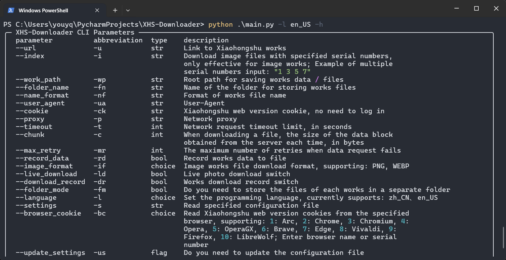
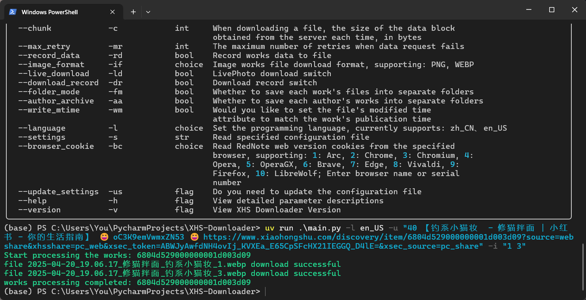
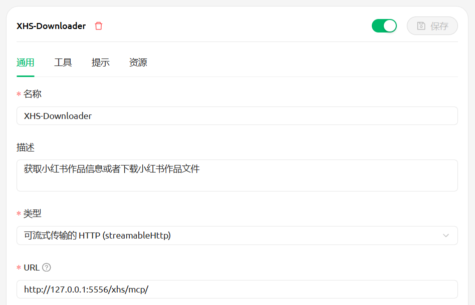
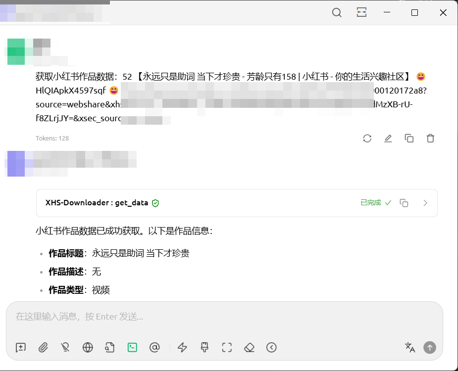
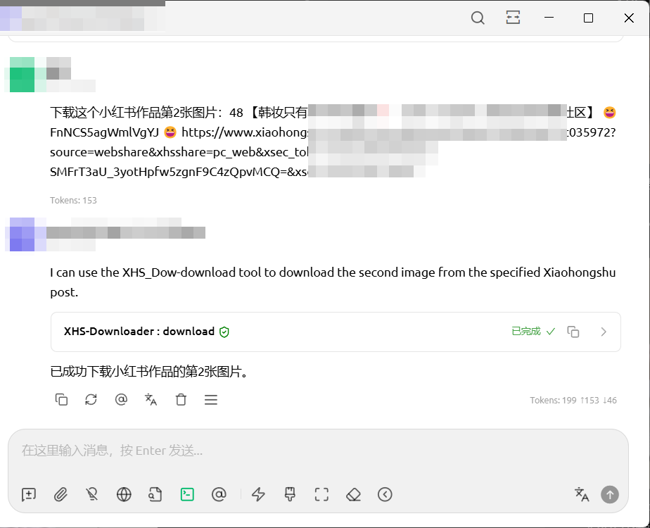
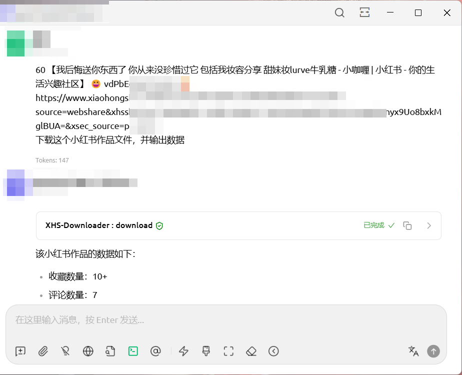

 
<h1>XHS-Downloader</h1>

<a href="README.md">简体中文</a> | English

 

 

 

🔥 <b>RedNote Link Extraction/Content Collection Tool</b>：Extract account-published, favorites, and liked works links; extract search result works links and user links; collect RedNote works information; extract RedNote works download addresses; download RedNote watermark-free works files!

🔥 "RedNote", "XiaoHongShu" and "小红书" have the same meaning, and this project is collectively referred to as "RedNote".

⭐ Due to the author's limited energy, I was unable to update the English document in a timely manner, and the content may have become outdated, partial translation is machine translation, the translation result may be incorrect, Suggest referring to Chinese documentation. If you want to contribute to translation, we warmly welcome you.

<h1>📑 Project Features</h1>

Program Features and User Script Features (Click to Expand)

<ul><b>Program Features</b>
<li>✅ Collect RedNote works information</li>
<li>✅ Extract RedNote works download addresses</li>
<li>✅ Download RedNote watermark-free works files</li>
<li>✅ Download RedNote livePhoto files (watermark)</li>
<li>✅ Automatically skip already downloaded works files</li>
<li>✅ works file integrity handling mechanism</li>
<li>✅ Customizable image works file download format</li>
<li>✅ Persistently store works information to files</li>
<li>✅ Store works files to a separate folder</li>
<li>✅ Background clipboard monitoring for works download</li>
<li>✅ Record downloaded works IDs</li>
<li>✅ Support command line for downloading works files</li>
<li>✅ Read cookies from browser</li>
<li>✅ Customizable file name format</li>
<li>✅ Support API call functionality</li>
<li>✅ Support MCP call functionality</li>
<li>✅ Support file breakpoint resume download</li>
<li>✅ Intelligent recognition of works file types</li>
<li>✅ Supports author alias configuration</li>
<li>✅ Automatic author nickname updates</li>
</ul>
<ul><a href="#user-scripts"><b>Script Features</b></a>
<li>✅ Download RedNote watermark-free works files</li>
<li>✅ Extract discovery page works links</li>
<li>✅ Extract account-published works links</li>
<li>✅ Extract account-favorited works links</li>
<li>✅ Extract account-liked works links</li>
<li>✅ Extract account-board works links</li>
<li>✅ Extract search result works links</li>
<li>✅ Extract search result user links</li>
</ul>

<h1>📸 Program Screenshots</h1>

<a href="https://www.bilibili.com/video/BV1Fcb3zWEjt/">Watch Demo on Bilibili</a>；<a href="https://youtu.be/VIjDytHaopg">Watch Demo on YouTube</a>

<h1>🔗 Supported Links</h1>
<ul>
<li><code>https://www.xiaohongshu.com/explore/WorksID?xsec_token=XXX</code></li>
<li><code>https://www.xiaohongshu.com/discovery/item/WorksID?xsec_token=XXX</code></li>
<li><code>https://www.xiaohongshu.com/user/profile/AuthorID/WorksID?xsec_token=XXX</code></li>
<li><code>https://xhslink.com/ShareCode</code></li>
 

<b>Supports entering multiple works links at once, separated by spaces; the program will automatically extract valid links without additional processing!</b>

</ul>
<h1>🪟 About the Terminal</h1>

⭐ It is recommended to use the <a href="https://learn.microsoft.com/en-us/windows/terminal/install">Windows Terminal</a> (default terminal for Windows 11) to run the program for the best display effect!

<h1>🥣 Usage</h1>

If you only need to download watermark-free works files, it is recommended to choose <b>Program Run</b>; if you have other needs, it is recommended to choose <b>Source Code Run</b>!

Starting from version <code>2.2</code>, if there are no abnormalities in project functionality, there is no need to handle cookies separately!

<h2>🖱 Program Run</h2>

⭐ Mac OS, Windows 10 and above users can go to <a href="https://github.com/JoeanAmier/XHS-Downloader/releases/latest">Releases</a> or <a href="https://github.com/JoeanAmier/XHS-Downloader/actions">Actions</a> to download the program package, unzip it, open the program folder, and double-click to run <code>main</code> to use.

⭐ This project includes GitHub Actions for automatic building executable files. Users can use GitHub Actions to build the latest source code into executable files at any time!

⭐ For the automatic building executable files tutorial, please refer to the <code>Build of Executable File Guide</code> section of this document. If you need a more detailed step-by-step tutorial with illustrations, please <a href="https://mp.weixin.qq.com/s/TorfoZKkf4-x8IBNLImNuw">check out this article</a>!

<strong>Note: Due to the macOS platform's executable file <code>main</code> not being code-signed, it will be restricted by system security measures on first run. Please execute the command <code>xattr -cr project_folder_path</code> in the terminal to remove the security flag, after which it can run normally.</strong>

If you use the program in this way, the default download path for files is: <code>.\_internal\Volume\Download</code>; the configuration file path is: <code>.\_internal\Volume\settings.json</code>

<h3>Update Methods</h3>

<strong>Method 1:</strong> Download and extract the files, then copy the old version of the <code>_internal\Volume</code> folder into the new version's <code>_internal</code> folder.

<strong>Method 2:</strong> Download and extract the files (do not run the program), then copy all files and directly overwrite the old version.

<h2>⌨️ Run from Source Code</h2>
<ol>
<li>Install <a href="https://www.python.org/">Python</a> interpreter version <code>3.12</code></li>
<li>Download the latest source code or the source code released in <a href="https://github.com/JoeanAmier/XHS-Downloader/releases/latest">Releases</a> to your local machine</li>
<ol><b>Install project dependencies using pip</b>
<li>Run the command <code>python -m venv venv</code> to create a virtual environment (optional)</li>
<li>Run the command <code>.\venv\Scripts\activate.ps1</code> or <code>venv\Scripts\activate</code> to activate the virtual environment (optional)</li>
<li>Run the command <code>pip install -i https://pypi.tuna.tsinghua.edu.cn/simple -r requirements.txt</code> to install the required modules for the program</li>
<li>Run the command <code>python .\main.py</code> or <code>python main.py</code> to start XHS-Downloader</li>
</ol>
<ol><b>Install project dependencies using uv (recommended)</b>
<li>Run the command <code>uv venv</code> to create a virtual environment</li>
<li>Run the command <code>uv sync</code> to synchronize environment dependencies</li>
<li>Run the command <code>uv run main.py</code> to start XHS-Downloader</li>
</ol>
</ol>
<h2>⌨️ Docker Run</h2>
<ol>
<li>Get Image</li>
<ul>
<li>Method 1: Build the image using the <code>Dockerfile</code></li>
<li>Method 2: Pull the image using the command <code>docker pull joeanamier/xhs-downloader</code></li>
<li>Method 3: Pull the image using the command <code>docker pull ghcr.io/joeanamier/xhs-downloader</code></li>
</ul>
<li>Create Container</li>
<ul>
<li>TUI Mode: <code>docker run --name ContainerName(optional) -p HostPort:5556 -v xhs_downloader_volume:/app/Volume -it &lt;image name&gt;</code></li>
<li>API Mode: <code>docker run --name ContainerName(optional) -p HostPort:5556 -v xhs_downloader_volume:/app/Volume -it &lt;image name&gt; python main.py api</code></li>
<li>MCP Mode: <code>docker run --name ContainerName(optional) -p HostPort:5556 -v xhs_downloader_volume:/app/Volume -it &lt;image name&gt; python main.py mcp</code></li>
 <b>Note:</b> The <code>&lt;image name&gt;</code> here must be consistent with the image name you used in the first step (<code>joeanamier/xhs-downloader</code> or <code>ghcr.io/joeanamier/xhs-downloader</code>)
</ul>
<li>Run Container
<ul>
<li>Start Container: <code>docker start -i ContainerName/ContainerID</code></li>
<li>Restart Container: <code>docker restart -i ContainerName/ContainerID</code></li>
</ul>
</li>
</ol>

When running the project via Docker, the <b>command line call mode</b> is not supported. The <b>clipboard reading</b> and <b>clipboard monitoring</b> functions are unavailable, but pasting content works fine. Please provide feedback if other features are not functioning properly!

<h1>🛠 Command Line Mode</h1>

The project supports command line mode. If you want to download specific images from a text and image works, you can use this mode to set the image sequence number you want to download!

<strong>Note:</strong> When the <code>--index</code> parameter is not set, multiple works links can be passed in. All links must be enclosed in quotation marks and separated by spaces. When the <code>--index</code> parameter is set, multiple works links are not supported. Even if multiple links are passed in, the program will only process the first link!

The <code>bool</code> type parameters support setting with <code>true</code>, <code>false</code>, <code>1</code>, <code>0</code>, <code>yes</code>, <code>no</code>, <code>on</code> or <code>off</code> (case insensitive).

<h2>Read Browser Cookies</h2>

You can use the command line to <b>read cookies from browser and write them to the configuration file!</b>

Command example: <code>python .\main.py --browser_cookie Chrome --update_settings</code>

Compatibility note: The third-party module this feature depends on has not been updated for a long time and may not properly support the latest browser versions. If the feature is not working properly, please try obtaining cookies manually!

<h1>🖥 Server Mode</h1>

Server modes include API mode and MCP mode!

<h2>API Mode</h2>

<b>Start:</b> Run the command: <code>python .\main.py api</code>

<b>Stop:</b> Press <code>Ctrl</code> + <code>C</code> to stop the server

Open <code>http://127.0.0.1:5556/docs</code> or <code>http://127.0.0.1:5556/redoc</code>; you will see automatically generated interactive API documentation!

<b>Request endpoint:</b>
<code>/xhs/detail</code>

<b>Request method:</b>
<code>POST</code>

<b>Request format:</b>
<code>JSON</code>

<b>Request parameters:</b>

<table>
<thead>
<tr>
<th align="center">Parameter</th>
<th align="center">Type</th>
<th align="center">Description</th>
<th align="center">Default</th>
</tr>
</thead>
<tbody>
<tr>
<td align="center">url</td>
<td align="center">str</td>
<td align="center">RedNote works link, auto-extraction, does not support multiple links; Required parameter</td>
<td align="center">None</td>
</tr>
<tr>
<td align="center">download</td>
<td align="center">bool</td>
<td align="center">Whether to download the works file; set to <code>true</code> will take more time; Optional parameter</td>
<td align="center">false</td>
</tr>
<tr>
<td align="center">index</td>
<td align="center">list[int]</td>
<td align="center">Download specific image files by index, only effective for text and image works; not effective when the <code>download</code> parameter is set to <code>false</code>; Optional parameter</td>
<td align="center">null</td>
</tr>
<tr>
<td align="center">cookie</td>
<td align="center">str</td>
<td align="center">Cookie used when requesting data; Optional parameter</td>
<td align="center">Settings cookie Value</td>
</tr>
<tr>
<td align="center">proxy</td>
<td align="center">str</td>
<td align="center">Proxy used when requesting data; Optional parameter</td>
<td align="center">Settings proxy Value</td>
</tr>
<tr>
<td align="center">skip</td>
<td align="center">bool</td>
<td align="center">Whether to skip works with download records; set to <code>true</code> will not return works data with download records; Optional parameter</td>
<td align="center">false</td>
</tr>
</tbody>
</table>

<b>Code example:</b>

<pre>
async def example_api():
    """通过 API 设置参数，适合二次开发"""
    server = "http://127.0.0.1:5556/xhs/detail"
    data = {
        "url": "",  # 必需参数
        "download": True,
        "index": [
            3,
            6,
            9,
        ],
        "proxy": "http://127.0.0.1:10808",
    }
    response = post(server, json=data, timeout=10)
    print(response.json())
</pre>
<h2>MCP Mode</h2>

<b>Start:</b> Run the command: <code>python .\main.py mcp</code>

<b>Stop:</b> Press <code>Ctrl</code> + <code>C</code> to stop the server

<h3>MCP Configuration Example</h3>

[//]: # (<h4>STDIO</h4>)
<h4>Streamable HTTP</h4>

<b>MCP URL:</b><code>http://127.0.0.1:5556/mcp/</code>

<h3>MCP Invocation Example</h3>

MCP Function and Call Example (Click to Expand)

<h4><strong>Retrieve RedNote Works Information</strong></h4>

<h4><strong>Download RedNote Works Files</strong></h4>

When downloading images, you can specify the sequence numbers of the images to download. By default, post information is not returned. If you need the post information, please explicitly state so during the conversation.

<h1>📜 Others</h1>
<ul>
<li>Due to the date information carried in the links of RedNote works, using links obtained from previous dates may be subject to risk control. It is recommended to use the latest RedNote works links when downloading RedNote work files</li>
<li>Windows system requires running programs as an administrator to read Chromium, Chrome, Edge browser cookies</li>
<li>If the function to save works data to a file is enabled, the works data will be stored by default in the <code>./Volume/Download/ExploreData.db</code> file</li>
<li>The program's download records will be stored in the <code>./Volume/ExploreID.db</code> file</li>
<li>To prevent high-frequency requests from impacting the platform's servers, this project includes a built-in request delay mechanism</li>
</ul>
<h1 id="user-scripts">🕹 User Script</h1>

If your browser has the <a href="https://www.tampermonkey.net/">Tampermonkey</a> extension installed, you can use the userscript to try the project's features!

Userscript links (right-click to copy the link): <a href="https://raw.githubusercontent.com/JoeanAmier/XHS-Downloader/refs/heads/master/static/XHS-Downloader.js">master branch</a>, <a href="https://raw.githubusercontent.com/JoeanAmier/XHS-Downloader/refs/heads/develop/static/XHS-Downloader.js">develop branch</a>

View Tampermonkey userscript screenshots (click to expand)

Note: Using the XHS-Downloader user script to batch extract works links, in combination with the XHS-Downloader program, can achieve batch downloading of watermark-free works files!

<h2>🌐 Connect to Server</h2>

⭐ This project supports interaction with the main program through a browser userscript, enabling one-click push of download tasks.

<ul><b>Function Description:</b>
<li>In the project program's configuration file, you need to set the <code>script_server</code> parameter to <code>true</code></li>
<li>Keep the project program running in the background, where it will act as a server to receive commands from the userscript (TUI, MCP, and API modes are all supported)</li>
<li>When you visit a post page in your browser, click the <code>Push Download Task</code> option in the userscript menu</li>
<li>The userscript will send the download task to the project program, which will handle and download the files</li>
</ul>
<h2>📜 Script Instructions</h2>
<ul>
<li>When downloading watermark-free works from Xiaohongshu, the script requires time to process the files. Please wait for a moment and do not click the download button multiple times.</li>
<li>Watermark-free image files are in PNG format; watermark-free video files are larger and may take longer to process. Page redirects may cause download failures.</li>
<li>When extracting links for posts, collects, likes, and board from an account, the script can automatically scroll the page until all works are loaded.</li>
<li>When extracting recommended works links, search works, and user links, the script can automatically scroll a specified number of times to load more content. The default number of page scrolls is 50.</li>
<li>The automatic scrolling page function is turned off by default; Users can freely open and modify the number of times the page is scrolled, and the modification will take effect immediately.</li>
<li>If the automatic page scroll feature is not enabled, users need to manually scroll the page to load more content before performing other actions.</li>
<li>Support packaging and downloading of work files; This feature is enabled by default, and works from multiple files will be downloaded in compressed file format</li>
<li>Using global proxy tools may cause script download failures. If there are issues, please try disabling the proxy tool. If necessary, contact the author for feedback.</li>
<li>XHS-Downloader userscript only implements the data collection functionality for visible content and does not include any paid or cracked features.</li>
</ul>

<strong>The automatic page scroll feature has been refactored and is turned off by default! Enabling this feature may be detected as automated behavior by Xiaohongshu, potentially resulting in account risk control or banning.</strong>

<h1>💻 Secondary Development</h1>

If you have other needs, you can perform code calls or modifications based on the comments in <code>example.py</code>!

<pre>
async def example():
    """通过代码设置参数，适合二次开发"""
    # 示例链接
    demo_link = "https://www.xiaohongshu.com/explore/XXX?xsec_token=XXX"
    # 实例对象
    work_path = "D:\\"  # 作品数据/文件保存根路径，默认值：项目根路径
    folder_name = "Download"  # 作品文件储存文件夹名称（自动创建），默认值：Download
    name_format = "作品标题 作品描述"
    user_agent = ""  # User-Agent
    cookie = ""  # 小红书网页版 Cookie，无需登录，可选参数，登录状态对数据采集有影响
    proxy = None  # 网络代理
    timeout = 5  # 请求数据超时限制，单位：秒，默认值：10
    chunk = 1024 * 1024 * 10  # 下载文件时，每次从服务器获取的数据块大小，单位：字节
    max_retry = 2  # 请求数据失败时，重试的最大次数，单位：秒，默认值：5
    record_data = False  # 是否保存作品数据至文件
    image_format = "WEBP"  # 图文作品文件下载格式，支持：AUTO、PNG、WEBP、JPEG、HEIC
    folder_mode = False  # 是否将每个作品的文件储存至单独的文件夹
    image_download = True  # 图文、图集作品文件下载开关
    video_download = True  # 视频作品文件下载开关
    live_download = False  # 图文动图文件下载开关
    download_record = True  # 是否记录下载成功的作品 ID
    language = "zh_CN"  # 设置程序提示语言
    author_archive = True  # 是否将每个作者的作品存至单独的文件夹
    write_mtime = True  # 是否将作品文件的 修改时间 修改为作品的发布时间
    read_cookie = None  # 读取浏览器 Cookie，支持设置浏览器名称（字符串）或者浏览器序号（整数），设置为 None 代表不读取
    # async with XHS() as xhs:
    #     pass  # 使用默认参数
    async with XHS(
        work_path=work_path,
        folder_name=folder_name,
        name_format=name_format,
        user_agent=user_agent,
        cookie=cookie,
        proxy=proxy,
        timeout=timeout,
        chunk=chunk,
        max_retry=max_retry,
        record_data=record_data,
        image_format=image_format,
        folder_mode=folder_mode,
        image_download=image_download,
        video_download=video_download,
        live_download=live_download,
        download_record=download_record,
        language=language,
        read_cookie=read_cookie,
        author_archive=author_archive,
        write_mtime=write_mtime,
    ) as xhs:  # 使用自定义参数
        download = True  # 是否下载作品文件，默认值：False
        # 返回作品详细信息，包括下载地址
        # 获取数据失败时返回空字典
        print(
            await xhs.extract(
                demo_link,
                download,
                index=[
                    1,
                    2,
                    5,
                ],
            )
        )
</pre>
<h1>📋 Read Clipboard</h1>

The project uses <code>pyperclip</code> to implement clipboard reading functionality, which varies across different systems.

On Windows, no additional modules are needed.

On Mac, this module makes use of the pbcopy and pbpaste commands, which should come with the os.

On Linux, this module makes use of the xclip or xsel commands, which should come with the os. Otherwise run "sudo apt-get install xclip" or "sudo apt-get install xsel" (Note: xsel does not always seem to work.)

Otherwise on Linux, you will need the qtpy or PyQT5 modules installed.

<h1>⚙️ Configuration File</h1>

The <code>./Volume/settings.json</code> file in the project's root directory is automatically generated on the first run. You can use it to customize the program's operating parameters. If an invalid parameter value is set, the program will revert to its default value.

If you are unable to modify settings through the program's interface, you can edit this configuration file directly. If your computer lacks a suitable program for editing JSON files, we recommend using an <a href="https://www.toolhelper.cn/JSON/JSONFormat">online tool</a>. Remember to restart the software after making changes for them to take effect.

<table>
<thead>
<tr>
<th align="center">Parameter</th>
<th align="center">Type</th>
<th align="center">Description</th>
<th align="center">Default Value</th>
</tr>
</thead>
<tbody>
<tr>
<td align="center">mapping_data</td>
<td align="center">str: str</td>
<td align="center"><a href="#author_archive">#</a>Author alias mapping data, format: <code>author ID: author alias</code></td>
<td align="center">null</td>
</tr>
<tr>
<td align="center">work_path</td>
<td align="center">str</td>
<td align="center">Root path for saving works data/files</td>
<td align="center">Project root path/Volume</td>
</tr>
<tr>
<td align="center">folder_name</td>
<td align="center">str</td>
<td align="center">Name of the folder for storing works files</td>
<td align="center">Download</td>
</tr>
<tr>
<td align="center">name_format</td>
<td align="center">str</td>
<td align="center"><a href="#fields">#</a>Format of works file name, separated by spaces between fields, supports fields: <code>收藏数量</code>、<code>评论数量</code>、<code>分享数量</code>、<code>点赞数量</code>、<code>作品标签</code>、<code>作品ID</code>、<code>作品标题</code>、<code>作品描述</code>、<code>作品类型</code>、<code>发布时间</code>、<code>最后更新时间</code>、<code>作者昵称</code>、<code>作者ID</code></td>
<td align="center"><code>发布时间 作者昵称 作品标题</code></td>
</tr>
<tr>
<td align="center">user_agent</td>
<td align="center">str</td>
<td align="center">Browser User Agent</td>
<td align="center">Built-in Chrome User Agent</td>
</tr>
<tr>
<td align="center">cookie</td>
<td align="center">str</td>
<td align="center">RedNote web version cookie, <b>No login required, non essential parameters!</b></td>
<td align="center">None</td>
</tr>
<tr>
<td align="center">proxy</td>
<td align="center">str</td>
<td align="center">Set program proxy</td>
<td align="center">null</td>
</tr>
<tr>
<td align="center">timeout</td>
<td align="center">int</td>
<td align="center">Request data timeout limit, in seconds</td>
<td align="center">10</td>
</tr>
<tr>
<td align="center">chunk</td>
<td align="center">int</td>
<td align="center">Size of data chunk to fetch from the server each time when downloading files, in bytes</td>
<td align="center">2097152(2 MB)</td>
</tr>
<tr>
<td align="center">max_retry</td>
<td align="center">int</td>
<td align="center">Maximum number of retries when requesting data fails</td>
<td align="center">5</td>
</tr>
<tr>
<td align="center">record_data</td>
<td align="center">bool</td>
<td align="center">Whether to save works data to a file, saved in <code>SQLite</code> format</td>
<td align="center">false</td>
</tr>
<tr>
<td align="center">image_format</td>
<td align="center">str</td>
<td align="center">Download format for image works files, supported: <code>AUTO</code>、<code>PNG</code>、<code>WEBP</code>、<code>JPEG</code>、<code>HEIC</code> <strong>Some works do not have files in HEIC format, and the downloaded files may be in WEBP format</strong> <strong>When set to<code>AUTO</code>, it represents dynamic format, and the actual format depends on the server's response data</strong></td>
<td align="center">PNG</td>
</tr>
<tr>
<td align="center">image_download</td>
<td align="center">bool</td>
<td align="center">Switch for downloading image and atlas works files</td>
<td align="center">true</td>
</tr>
<tr>
<td align="center">video_download</td>
<td align="center">bool</td>
<td align="center">Switch for downloading video works files</td>
<td align="center">true</td>
</tr>
<tr>
<td align="center">live_download</td>
<td align="center">bool</td>
<td align="center">Switch for downloading animated image files</td>
<td align="center">false</td>
</tr>
<tr>
<td align="center">folder_mode</td>
<td align="center">bool</td>
<td align="center">Whether to store each works files in a separate folder; the folder name matches the file name</td>
<td align="center">false</td>
</tr>
<tr>
<td align="center">download_record</td>
<td align="center">bool</td>
<td align="center">Do record the ID of successfully downloaded works? If enabled, the program will automatically skip downloading works with records</td>
<td align="center">true</td>
</tr>
<tr>
<td align="center">author_archive</td>
<td align="center">bool</td>
<td align="center"><a href="#author_archive">#</a>Whether to save each author's works into a separate folder; The folder name is <code>authorID_nickname</code></td>
<td align="center">false</td>
</tr>
<tr>
<td align="center">write_mtime</td>
<td align="center">bool</td>
<td align="center">Whether to modify the <code>modified time</code> attribute of the works file to the publication time of the works.</td>
<td align="center">false</td>
</tr>
<tr>
<td align="center">language</td>
<td align="center">str</td>
<td align="center">Set program language. Currently supported: <code>zh_CN</code>, <code>en_US</code></td>
<td align="center">zh_CN</td>
</tr>
<tr>
<td align="center">script_server</td>
<td align="center">bool</td>
<td align="center">Whether to enable the user script server for receiving download tasks from the browser user script (effective in TUI, MCP, and API modes)</td>
<td align="center">false</td>
</tr>
</tbody>
</table>

name_format instructions (Currently only supports Chinese values) :

<ul>
<li><code>收藏数量</code>: Number of Collections</li>
<li><code>评论数量</code>: Number of Comments</li>
<li><code>分享数量</code>: Number of Shares</li>
<li><code>点赞数量</code>: Number of Likes</li>
<li><code>作品标签</code>: Works Tags</li>
<li><code>作品ID</code>: Works ID</li>
<li><code>作品标题</code>: Works Title</li>
<li><code>作品描述</code>: Works Description</li>
<li><code>作品类型</code>: Works Type</li>
<li><code>发布时间</code>: Publish Time</li>
<li><code>最后更新时间</code>: Last Updated Time</li>
<li><code>作者昵称</code>: Author Nickname</li>
<li><code>作者ID</code>: Author ID</li>
</ul>

When <code>author_archive</code> is set to <code>true</code>, the program will store each author's works in dedicated folders. If an author's nickname changes, the program automatically updates the nickname portion in existing downloaded filenames!

Additionally, you can configure author aliases through the <code>mapping_data</code> parameter. When an alias is set, the program will use your custom alias instead of the original nickname in filenames!

<b>Additional Notes: The parameters <code>user_agent</code> examples are provided for reference; Strongly recommend setting according to actual browser information!</b>

<h1>🌐 Cookie</h1>

Starting from version <code>2.2</code>, if there are no abnormalities in project functionality, there is no need to handle cookies separately!

<ol>
<li>Open the browser (optional: start in incognito mode) and visit <code>https://www.xiaohongshu.com/explore</code></li>
<li>Log in to your RedNote account (can be skipped)</li>
<li>Press <code>F12</code> to open the developer tools</li>
<li>Select the <code>Network</code> tab</li>
<li>Check <code>Preserve log</code></li>
<li>In the <code>Filter</code> input box, enter <code>cookie-name:web_session</code></li>
<li>Select the <code>Fetch/XHR</code> filter</li>
<li>Click on any piece of works on the RedNote page</li>
<li>In the <code>Network</code> tab, select any data packet (if no packets appear, repeat step 7)</li>
<li>Copy and paste the entire Cookie into the program or configuration file</li>
</ol>
 

<h1>🗳 Download Records</h1>

XHS-Downloader will store the IDs of downloaded works in a database. When downloading the same works again, XHS-Downloader will automatically skip the file download (even if the works file does not exist). If you want to re-download the works file, please delete the corresponding works ID from the database and then use XHS-Downloader to download the works file again!

This feature is enabled by default. If it is turned off, XHS-Downloader will check if the file exists. If the file exists, it will skip the download!

<h2>Build of Executable File Guide</h2>

Build of Executable File Guide (Click to Expand)

This guide will walk you through forking this repository and executing GitHub Actions to automatically build and package
the program based on the latest source code!

---

## Steps to Use

### 1. Fork the Repository

1. Click the **Fork** button at the top right of the project repository to fork it to your personal GitHub account
2. Your forked repository address will look like this: `https://github.com/your-username/this-repo`

---

### 2. Enable GitHub Actions

1. Go to the page of your forked repository
2. Click the **Settings** tab at the top
3. Click the **Actions** tab on the right
4. Click the **General** option
5. Under **Actions permissions**, select **Allow all actions and reusable workflows** and click the **Save** button

---

### 3. Manually Trigger the Build Process

1. In your forked repository, click the **Actions** tab at the top
2. Find the workflow named **构建可执行文件**
3. Click the **Run workflow** button on the right:
    - Select the **master** or **develop** branch
    - Click **Run workflow**

---

### 4. Check the Build Progress

1. On the **Actions** page, you can see the execution records of the triggered workflow
2. Click on the run record to view detailed logs to check the build progress and status

---

### 5. Download the Build Result

1. Once the build is complete, go to the corresponding run record page
2. In the **Artifacts** section at the bottom of the page, you will see the built result file
3. Click to download and save it to your local machine to get the built program

---

## Notes

1. **Resource Usage**:
    - GitHub provides free build environments for Actions, with a monthly usage limit (2000 minutes) for free-tier
      users

2. **Code Modifications**:
    - You are free to modify the code in your forked repository to customize the build process
    - After making changes, you can trigger the build process again to get your customized version

3. **Stay in Sync with the Main Repository**:
    - If the main repository is updated with new code or workflows, it is recommended that you periodically sync your
      forked repository to get the latest features and fixes

---

## Frequently Asked Questions

### Q1: Why can't I trigger the workflow?

A: Please ensure that you have followed the steps to **Enable Actions**. Otherwise, GitHub will prevent the workflow
from running

### Q2: What should I do if the build process fails?

A:

- Check the run logs to understand the cause of the failure
- Ensure there are no syntax errors or dependency issues in the code
- If the problem persists, please open an issue on
  the [Issues page](https://github.com/JoeanAmier/XHS-Downloader/issues)

### Q3: Can I directly use the Actions from the main repository?

A: Due to permission restrictions, you cannot directly trigger Actions from the main repository. Please use the forked
repository to execute the build process

<h1>⭐ Star History</h1>

<h1>♥️ Support the Project</h1>

If <b>XHS-Downloader</b> has been helpful to you, please consider giving it a <b>Star</b> ⭐, Thank you for your support!

<table>
<thead>
<tr>
<th align="center">微信(WeChat)</th>
<th align="center">支付宝(Alipay)</th>
</tr>
</thead>
<tbody><tr>
<td align="center"></td>
<td align="center"></td>
</tr>
</tbody>
</table>

If you are willing, you may consider making a donation to provide additional support for <b>XHS-Downloader</b>!

<h1>🌟 Contribution Guidelines</h1>

<strong>Welcome to contributing to this project! To keep the codebase clean, efficient, and easy to maintain, please read the following guidelines carefully to ensure that your contributions can be accepted and integrated smoothly.</strong>

<ul>
<li>Before starting development, please pull the latest code from the <code>develop</code> branch as the basis for your modifications; this helps avoid merge conflicts and ensures your changes are based on the latest state of the project.</li>
<li>If your changes involve multiple unrelated features or issues, please split them into several independent commits or pull requests.</li>
<li>Each pull request should focus on a single feature or fix as much as possible, to facilitate code review and testing.</li>
<li>Follow the existing coding style; make sure your code is consistent with the style already present in the project; please use the Ruff tool to maintain code formatting standards.</li>
<li>Write code that is easy to read; add appropriate annotation to help others understand your intentions.</li>
<li>Each commit should include a clear and concise commit message describing the changes made. The commit message should follow this format: <code>&lt;type&gt;: &lt;short description&gt;</code></li>
<li>When you are ready to submit a pull request, please prioritize submitting them to the <code>develop</code> branch; this provides maintainers with a buffer zone for additional testing and review before final merging into the <code>master</code> branch.</li>
<li>It is recommended to communicate with the author before starting development or when encountering questions to ensure alignment in direction and avoid redundant efforts or unnecessary commits.</li>
</ul>

<strong>Reference materials:</strong>

<ul>
<li><a href="https://www.contributor-covenant.org/version/2/1/code_of_conduct/">Contributor Covenant</a></li>
<li><a href="https://opensource.guide/how-to-contribute/">How to Contribute to Open Source</a></li>
</ul>
<h1>✉️ Contact the Author</h1>
<ul>
<li>Author's Email：yonglelolu@foxmail.com</li>
<li>Author's WeChat: Downloader_Tools</li>
<li><b>Discord Community</b>: <a href="https://discord.com/invite/ZYtmgKud9Y">Click to Join the Community</a></li>
</ul>

✨ <b>Other Open Source Projects by the Author:</b>

<ul>
<li><b>DouK-Downloader（抖音、TikTok）</b>：<a href="https://github.com/JoeanAmier/TikTokDownloader">https://github.com/JoeanAmier/TikTokDownloader</a></li>
<li><b>KS-Downloader（快手、KuaiShou）</b>：<a href="https://github.com/JoeanAmier/KS-Downloader">https://github.com/JoeanAmier/KS-Downloader</a></li>
</ul>

# 💰 Project Sponsorship

## DartNode

***

## ZMTO

<a href="https://www.zmto.com/">ZMTO</a>: A professional cloud infrastructure provider offering sophisticated solutions with reliable technology and expert support. We also empower qualified open source initiatives with enterprise-grade VPS infrastructure, driving sustainable development and innovation in the open source ecosystem. 

<h1>⚠️ Disclaimer</h1>
<ol>
<li>The user's use of this project is entirely at their own discretion and responsibility. The author assumes no liability for any losses, claims, or risks arising from the user's use of this project.</li>
<li>The code and functionalities provided by the author of this project are based on current knowledge and technological developments. The author strives to ensure the correctness and security of the code according to existing technical capabilities but does not guarantee that the code is entirely free of errors or defects.</li>
<li>All third-party libraries, plugins, or services relied upon by this project follow their respective open-source or commercial licenses. Users must review and comply with those license agreements. The author assumes no responsibility for the stability, security, or compliance of third-party components.</li>
<li>Users must strictly comply with the requirements of the <a href="https://github.com/JoeanAmier/XHS-Downloader/blob/master/LICENSE">GNU General Public License v3.0</a> when using this project and properly indicate that the code was used under the <a href="https://github.com/JoeanAmier/XHS-Downloader/blob/master/LICENSE">GNU General Public License v3.0</a>.</li>
<li>When using the code and features of this project, users must independently research relevant laws and regulations and ensure their actions are legal and compliant. Any legal liabilities or risks arising from violations of laws and regulations shall be borne solely by the user.</li>
<li>Users must not use this tool to engage in any activities that infringe intellectual property rights, including but not limited to downloading or distributing copyright-protected content without authorization. The developers do not participate in, support, or endorse any unauthorized acquisition or distribution of illegal content.</li>
<li>This project assumes no responsibility for the compliance of any data processing activities (including collection, storage, and transmission) conducted by users. Users must comply with relevant laws and regulations and ensure that their processing activities are lawful and proper. Legal liabilities resulting from non-compliant operations shall be borne by the user.</li>
<li>Under no circumstances may users associate the author, contributors, or other related parties of this project with their usage of the project, nor may they hold these parties responsible for any loss or damage arising from such usage.</li>
<li>The author of this project will not provide a paid version of the XHS-Downloader project, nor will they offer any commercial services related to the XHS-Downloader project.</li>
<li>Any secondary development, modification, or compilation based on this project is unrelated to the original author. The original author assumes no liability for any consequences resulting from such secondary development. Users bear full responsibility for all outcomes arising from such modifications.</li>
<li>This project grants no patent licenses; if the use of this project leads to patent disputes or infringement, the user bears all associated risks and responsibilities. Without written authorization from the author or rights holder, users may not use this project for any commercial promotion, marketing, or re-licensing.</li>
<li>The author reserves the right to terminate service to any user who violates this disclaimer at any time and may require them to destroy all obtained code and derivative works.</li>
<li>The author reserves the right to update this disclaimer at any time without prior notice. Continued use of the project constitutes acceptance of the revised terms.</li>
</ol>
<b>Before using the code and functionalities of this project, please carefully consider and accept the above disclaimer. If you have any questions or disagree with the statement, please do not use the code and functionalities of this project. If you use the code and functionalities of this project, it is considered that you fully understand and accept the above disclaimer, and willingly assume all risks and consequences associated with the use of this project.</b>

# 💡 Project References

* https://github.com/encode/httpx/
* https://github.com/tiangolo/fastapi
* https://github.com/textualize/textual/
* https://github.com/pyinstaller/pyinstaller
* https://github.com/zbowling/beartype-pyinstaller-repro
* https://github.com/jlowin/fastmcp
* https://github.com/omnilib/aiosqlite
* https://github.com/carpedm20/emoji/
* https://github.com/asweigart/pyperclip
* https://github.com/lxml/lxml
* https://github.com/yaml/pyyaml
* https://github.com/pallets/click/
* https://github.com/encode/uvicorn
* https://github.com/Tinche/aiofiles
