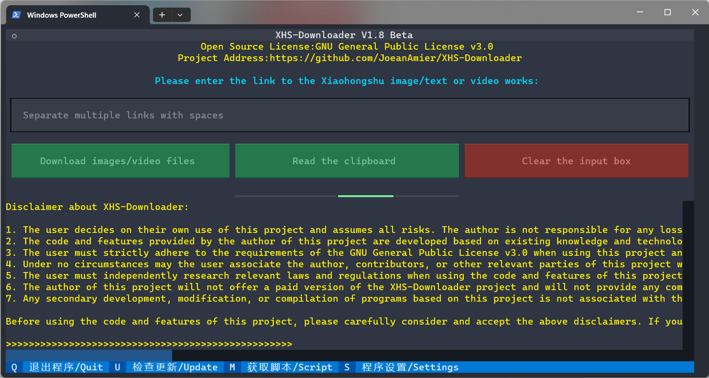
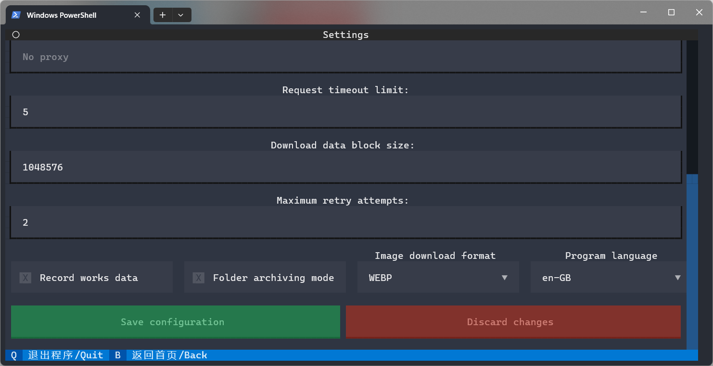
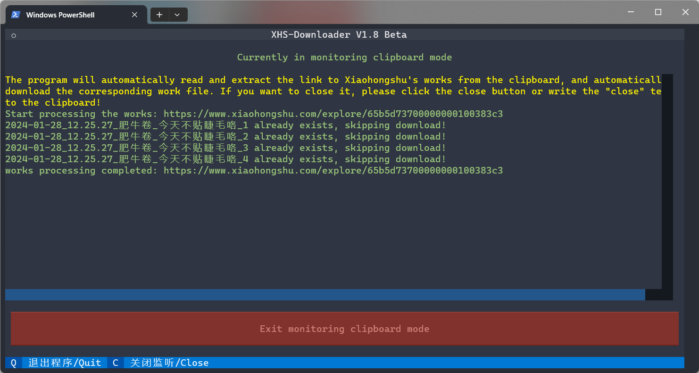
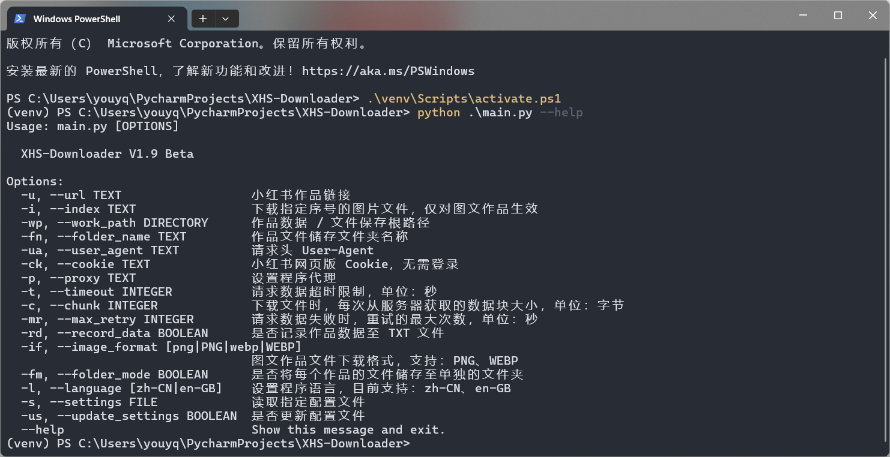
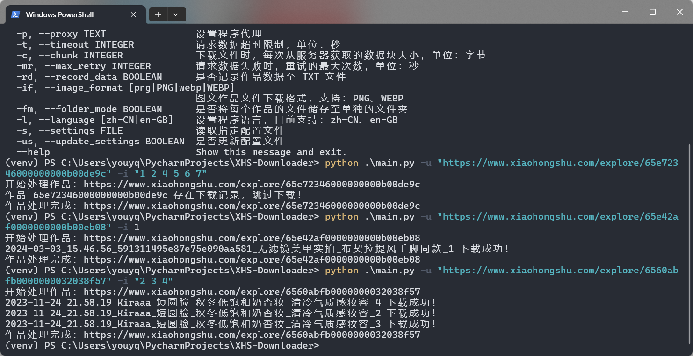
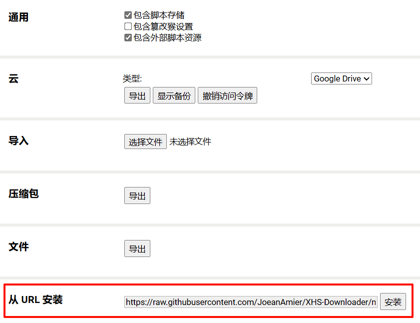
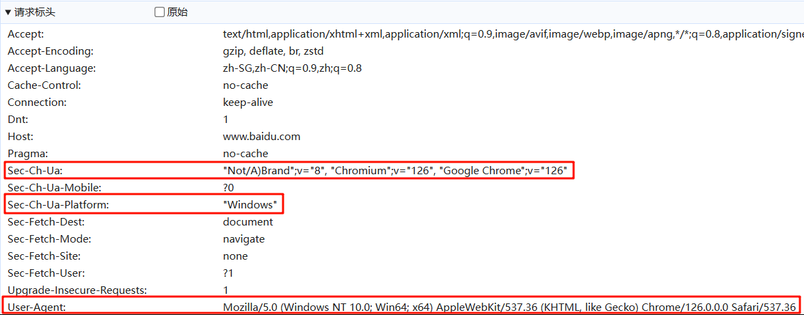
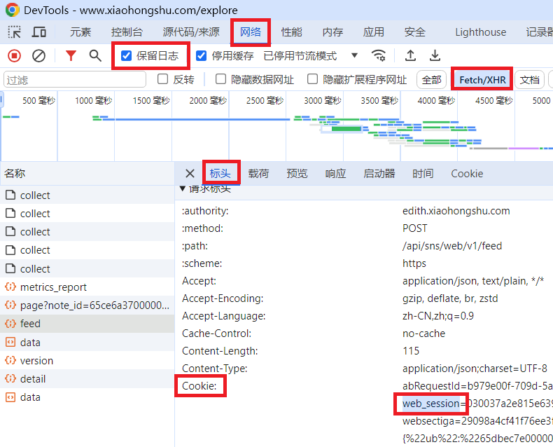

 
<h1>XHS-Downloader</h1>

<a href="README.md">简体中文</a> | English

 

 

🔥 <b>Xiaohongshu Link Extraction/Content Collection Tool</b>：Extract account-published, favorited, and liked content links; extract search result content links and user links; collect Xiaohongshu content information; extract Xiaohongshu content download addresses; download Xiaohongshu watermark-free content files!

<strong>⚠️ 2024/9/24: Due to rule updates on Xiaohongshu, there is a risk of account suspension for user scripts with version numbers lower than <code>1.7.1</code> Please update the user scripts in a timely manner before using them!</strong>

<strong>⚠️ 2024/10/13: Due to the date information carried in the links of Xiaohongshu works, using links obtained from previous dates may be subject to risk control. It is recommended to use the latest Xiaohongshu works links when downloading Xiaohongshu work files!</strong>

⭐ This project is completely free and open-source, with no paid features. Please do not be deceived!

⭐ Due to the author's limited energy, I was unable to update the English document in a timely manner, and the content may have become outdated, partial translation is machine translation, the translation result may be incorrect, Suggest referring to Chinese documentation. If you want to contribute to translation, we warmly welcome you.

<h1>📑 Project Features</h1>
<ul><b>Program Features</b>
<li>✅ Collect Xiaohongshu works information</li>
<li>✅ Extract Xiaohongshu works download addresses</li>
<li>✅ Download Xiaohongshu watermark-free works files</li>
<li>✅ Download Xiaohongshu livePhoto files (non-watermark-free)</li>
<li>✅ Automatically skip already downloaded works files</li>
<li>✅ works file integrity handling mechanism</li>
<li>✅ Customizable image works file download format</li>
<li>✅ Persistently store works information to files</li>
<li>✅ Store works files to a separate folder</li>
<li>✅ Background clipboard monitoring for works download</li>
<li>✅ Record downloaded works IDs</li>
<li>✅ Support command line for downloading works files</li>
<li>✅ Read cookies from browser</li>
<li>✅ Customizable file name format</li>
<li>✅ Support API call functionality</li>
<li>✅ Support file breakpoint resume download</li>
</ul>
<ul><b>Script Features</b>
<li>✅ Download Xiaohongshu watermark-free works files</li>
<li>✅ Extract discovery page works links</li>
<li>✅ Extract account-published works links</li>
<li>✅ Extract account-favorited works links</li>
<li>✅ Extract account-liked works links</li>
<li>✅ Extract account-board works links</li>
<li>✅ Extract search result works links</li>
<li>✅ Extract search result user links</li>
</ul>

⭐ The development plan and progress of XHS-Downloader can be found at <a href="https://github.com/users/JoeanAmier/projects/5">Projects</a>

<h1>📸 Program Screenshots</h1>

<b>🎥 Click the images to watch the demo video</b>

<h1>🔗 Supported Links</h1>
<ul>
<li><code>https://www.xiaohongshu.com/explore/WorksID</code></li>
<li><code>https://www.xiaohongshu.com/explore/WorksID?xsec_token=XXX</code></li>
<li><code>https://www.xiaohongshu.com/discovery/item/WorksID</code></li>
<li><code>https://xhslink.com/ShareCode</code></li>
 

<b>Supports entering multiple content links at once, separated by spaces; the program will automatically extract valid links without additional processing!</b>

</ul>
<h1>🪟 About the Terminal</h1>

⭐ It is recommended to use the <a href="https://learn.microsoft.com/en-us/windows/terminal/install">Windows Terminal</a> (default terminal for Windows 11) to run the program for the best display effect!

<h1>🥣 Usage</h1>

If you only need to download watermark-free content files, it is recommended to choose <b>Program Run</b>; if you have other needs, it is recommended to choose <b>Source Code Run</b>!

Starting from version <code>2.2</code>, if there are no abnormalities in project functionality, there is no need to handle cookies separately!

<h2>🖱 Program Run</h2>

Mac OS, Windows 10 and above users can go to <a href="https://github.com/JoeanAmier/XHS-Downloader/releases/latest">Releases</a> to download the program package, unzip it, open the program folder, and double-click to run <code>main</code> to use.

<strong>Note: The executable file <code>main</code> for Mac OS may need to be launched from the terminal command line; Due to device limitations, the Mac OS executable file has not been tested and its availability cannot be guaranteed!</strong>

If you use the program in this way, the default download path for files is: <code>.\_internal\Download</code>; the configuration file path is: <code>.\_internal\settings.json</code>

<h2>⌨️ Docker Run</h2>
<ol>
<li>Get Image</li>
<ul>
<li>Method 1: Build the image using the <code>Dockerfile</code></li>
<li>Method 2: Pull the image using the command <code>docker pull joeanamier/xhs-downloader</code></li>
</ul>
<li>Create Container</li>
<ul>
<li>TUI Mode: <code>docker run -it joeanamier/xhs-downloader</code></li>
<li>API Mode: <code>docker run -it joeanamier/xhs-downloader python main.py server</code></li>
</ul>
</ol>

When running the project via Docker, the <b>command line call mode</b> is not supported. The <b>clipboard reading</b> and <b>clipboard monitoring</b> functions are unavailable, but pasting content works fine. Please provide feedback if other features are not functioning properly!

<h2>⌨️ Source Code Run</h2>
<ol>
<li>Install the Python interpreter with a version no lower than <code>3.12</code></li>
<li>Download the latest source code of this project or the source code released in <a href="https://github.com/JoeanAmier/XHS-Downloader/releases/latest">Releases</a> to your local machine</li>
<li>Open the terminal and switch to the root path of the project</li>
<li>Run the command <code>pip install -i https://pypi.tuna.tsinghua.edu.cn/simple -r requirements.txt</code> to install the required modules</li>
<li>Run <code>main.py</code> to use</li>
</ol>
<h1>🛠 Command Line Mode</h1>

The project supports command line mode. If you want to download specific images from a text and image work, you can use this mode to set the image sequence number you want to download!

You can use the command line to <b>read cookies from the browser and write to the configuration file!</b>

Command example: <code>python .\main.py --browser_cookie Chrome --update_settings</code>

The <code>bool</code> type parameters support setting with <code>true</code>, <code>false</code>, <code>1</code>, <code>0</code>, <code>yes</code>, <code>no</code>, <code>on</code> or <code>off</code> (case insensitive).

<h1>🖥 Server Mode</h1>

<b>Start:</b> Run the command: <code>python .\main.py server</code>

<b>Stop:</b> Press <code>Ctrl</code> + <code>C</code> to stop the server

<b>Request endpoint:</b>
<code>/xhs/</code>

<b>Request method:</b>
<code>POST</code>

<b>Request format:</b>
<code>JSON</code>

<b>Request parameters:</b>

<table>
<thead>
<tr>
<th align="center">Parameter</th>
<th align="center">Type</th>
<th align="center">Description</th>
<th align="center">Default</th>
</tr>
</thead>
<tbody>
<tr>
<td align="center">url</td>
<td align="center">str</td>
<td align="center">Xiaohongshu content link, auto-extraction, does not support multiple links</td>
<td align="center">None</td>
</tr>
<tr>
<td align="center">download</td>
<td align="center">bool</td>
<td align="center">Whether to download the content file; set to <code>true</code> will take more time</td>
<td align="center">false</td>
</tr>
<tr>
<td align="center">index</td>
<td align="center">list[int]</td>
<td align="center">Download specific image files by index, only effective for text and image works; not effective when the <code>download</code> parameter is set to <code>false</code></td>
<td align="center">null</td>
</tr>
<tr>
<td align="center">skip</td>
<td align="center">bool</td>
<td align="center">Whether to skip content with download records; set to <code>true</code> will not return content data with download records</td>
<td align="center">false</td>
</tr>
</tbody>
</table>

<b>Code example:</b>

<pre>
def api_demo():
    server = "http://127.0.0.1:8000/xhs/"
    data = {
        "url": "https://www.xiaohongshu.com/explore/123456789",
        "download": True,
        "index": [
            3,
            6,
            9,
        ],
    }
    response = requests.post(server, json=data)
    print(response.json())
</pre>
<h1>🕹 User Script</h1>

If your browser has the <a href="https://www.tampermonkey.net/">Tampermonkey</a> browser extension installed, you can add the <a href="https://raw.githubusercontent.com/JoeanAmier/XHS-Downloader/master/static/XHS-Downloader.js">user script</a> to experience the project features without needing to download or install anything!

After successfully installing the script, open the Xiaohongshu page, check the script instructions, and follow the prompts to operate.

Note: Using the XHS-Downloader user script to batch extract content links, in combination with the XHS-Downloader program, can achieve batch downloading of watermark-free content files!

<h1>💻 Secondary Development</h1>

If you have other needs, you can perform code calls or modifications based on the comments in <code>main.py</code>!

<pre>
async def example():
    """通过代码设置参数，适合二次开发"""
    # 示例链接
    error_link = "https://github.com/JoeanAmier/XHS_Downloader"
    demo_link = "https://www.xiaohongshu.com/explore/xxxxxxxxxx"
    multiple_links = f"{demo_link} {demo_link} {demo_link}"
    # 实例对象
    work_path = "D:\\"  # 作品数据/文件保存根路径，默认值：项目根路径
    folder_name = "Download"  # 作品文件储存文件夹名称（自动创建），默认值：Download
    name_format = "作品标题 作品描述"
    user_agent = ""  # User-Agent
    cookie = ""  # 小红书网页版 Cookie，无需登录，可选参数，登录状态对数据采集有影响
    proxy = None  # 网络代理
    timeout = 5  # 请求数据超时限制，单位：秒，默认值：10
    chunk = 1024 * 1024 * 10  # 下载文件时，每次从服务器获取的数据块大小，单位：字节
    max_retry = 2  # 请求数据失败时，重试的最大次数，单位：秒，默认值：5
    record_data = False  # 是否保存作品数据至文件
    image_format = "WEBP"  # 图文作品文件下载格式，支持：PNG、WEBP
    folder_mode = False  # 是否将每个作品的文件储存至单独的文件夹
    # async with XHS() as xhs:
    #     pass  # 使用默认参数
    async with XHS(
            work_path=work_path,
            folder_name=folder_name,
            name_format=name_format,
            user_agent=user_agent,
            cookie=cookie,
            proxy=proxy,
            timeout=timeout,
            chunk=chunk,
            max_retry=max_retry,
            record_data=record_data,
            image_format=image_format,
            folder_mode=folder_mode,
    ) as xhs:  # 使用自定义参数
        download = True  # 是否下载作品文件，默认值：False
        # 返回作品详细信息，包括下载地址
        # 获取数据失败时返回空字典
        print(await xhs.extract(error_link, download, ))
        print(await xhs.extract(demo_link, download, index=[1, 2]))
        # 支持传入多个作品链接
        print(await xhs.extract(multiple_links, download, ))
</pre>
<h1>📋 Read Clipboard</h1>

The project uses <code>pyperclip</code> to implement clipboard reading functionality, which varies across different systems.

On Windows, no additional modules are needed.

On Mac, this module makes use of the pbcopy and pbpaste commands, which should come with the os.

On Linux, this module makes use of the xclip or xsel commands, which should come with the os. Otherwise run "sudo apt-get install xclip" or "sudo apt-get install xsel" (Note: xsel does not always seem to work.)

Otherwise on Linux, you will need the qtpy or PyQT5 modules installed.

<h1>⚙️ Configuration File</h1>

The <code>settings.json</code> file in the root directory of the project is automatically generated on the first run and allows customization of some runtime parameters.

If invalid parameter values are set, the program will use the default values!

<table>
<thead>
<tr>
<th align="center">Parameter</th>
<th align="center">Type</th>
<th align="center">Description</th>
<th align="center">Default Value</th>
</tr>
</thead>
<tbody>
<tr>
<td align="center">work_path</td>
<td align="center">str</td>
<td align="center">Root path for saving content data/files</td>
<td align="center">Project root path</td>
</tr>
<tr>
<td align="center">folder_name</td>
<td align="center">str</td>
<td align="center">Name of the folder for storing content files</td>
<td align="center">Download</td>
</tr>
<tr>
<td align="center">name_format</td>
<td align="center">str</td>
<td align="center">Format for content file names. Separate fields with spaces. Supported fields: <code>collects</code>, <code>comments</code>, <code>shares</code>, <code>likes</code>, <code>tags</code>, <code>ID</code>, <code>title</code>, <code>description</code>, <code>type</code>, <code>publish_time</code>, <code>last_update_time</code>, <code>author_nickname</code>, <code>author_id</code></td>
<td align="center"><code>publish_time author_nickname title</code></td>
</tr>
<tr>
<td align="center">user_agent</td>
<td align="center">str</td>
<td align="center">Browser User Agent</td>
<td align="center">Built-in Chrome User Agent</td>
</tr>
<tr>
<td align="center">cookie</td>
<td align="center">str</td>
<td align="center">Xiaohongshu web version cookie, <b>No login required, non essential parameters!</b></td>
<td align="center">None</td>
</tr>
<tr>
<td align="center">proxy</td>
<td align="center">str | dict</td>
<td align="center">Set program proxy</td>
<td align="center">null</td>
</tr>
<tr>
<td align="center">timeout</td>
<td align="center">int</td>
<td align="center">Request data timeout limit, in seconds</td>
<td align="center">10</td>
</tr>
<tr>
<td align="center">chunk</td>
<td align="center">int</td>
<td align="center">Size of data chunk to fetch from the server each time when downloading files, in bytes</td>
<td align="center">2097152(2 MB)</td>
</tr>
<tr>
<td align="center">max_retry</td>
<td align="center">int</td>
<td align="center">Maximum number of retries when requesting data fails</td>
<td align="center">5</td>
</tr>
<tr>
<td align="center">record_data</td>
<td align="center">bool</td>
<td align="center">Whether to save content data to a file, saved in <code>SQLite</code> format</td>
<td align="center">false</td>
</tr>
<tr>
<td align="center">image_format</td>
<td align="center">str</td>
<td align="center">Download format for text and image content files, supported formats: <code>PNG</code>, <code>WEBP</code> <strong>This parameter affects the API used when downloading images, not the fixed image format!</strong></td>
<td align="center">PNG</td>
</tr>
<tr>
<td align="center">image_download</td>
<td align="center">bool</td>
<td align="center">Switch for downloading text and image content files</td>
<td align="center">true</td>
</tr>
<tr>
<td align="center">video_download</td>
<td align="center">bool</td>
<td align="center">Switch for downloading video content files</td>
<td align="center">true</td>
</tr>
<tr>
<td align="center">live_download</td>
<td align="center">bool</td>
<td align="center">Switch for downloading animated image files</td>
<td align="center">false</td>
</tr>
<tr>
<td align="center">folder_mode</td>
<td align="center">bool</td>
<td align="center">Whether to store each content's files in a separate folder; the folder name matches the file name</td>
<td align="center">false</td>
</tr>
<tr>
<td align="center">download_record</td>
<td align="center">bool</td>
<td align="center">Do record the ID of successfully downloaded works? If enabled, the program will automatically skip downloading works with records</td>
<td align="center">true</td>
</tr>
<tr>
<td align="center">language</td>
<td align="center">str</td>
<td align="center">Set program language. Currently supported: <code>zh_CN</code>, <code>en_GB</code></td>
<td align="center">zh_CN</td>
</tr>
</tbody>
</table>

<b>Additional Notes: The parameters <code>user_agent</code> examples are provided for reference; Strongly recommend setting according to actual browser information!</b>

<h1>🌐 Cookie</h1>

Starting from version <code>2.2</code>, if there are no abnormalities in project functionality, there is no need to handle cookies separately!

<ol>
<li>Open the browser (optional: start in incognito mode) and visit <code>https://www.xiaohongshu.com/explore</code></li>
<li>Log in to your Xiaohongshu account (can be skipped)</li>
<li>Press <code>F12</code> to open the developer tools</li>
<li>Select the <code>Network</code> tab</li>
<li>Check <code>Preserve log</code></li>
<li>In the <code>Filter</code> input box, enter <code>cookie-name:web_session</code></li>
<li>Select the <code>Fetch/XHR</code> filter</li>
<li>Click on any piece of content on the Xiaohongshu page</li>
<li>In the <code>Network</code> tab, select any data packet (if no packets appear, repeat step 7)</li>
<li>Copy and paste the entire Cookie into the program or configuration file</li>
</ol>
 

<h1>🗳 Download Records</h1>

XHS-Downloader will store the IDs of downloaded content in a database. When downloading the same content again, XHS-Downloader will automatically skip the file download (even if the content file does not exist). If you want to re-download the content file, please delete the corresponding content ID from the database and then use XHS-Downloader to download the content file again!

This feature is enabled by default. If it is turned off, XHS-Downloader will check if the file exists. If the file exists, it will skip the download!

<h1>♥️ Support the Project</h1>

If <b>XHS-Downloader</b> has been helpful to you, please consider giving it a <b>Star</b> ⭐. Thank you for your support!

<table>
<thead>
<tr>
<th align="center">微信(WeChat)</th>
<th align="center">支付宝(Alipay)</th>
</tr>
</thead>
<tbody><tr>
<td align="center"></td>
<td align="center"></td>
</tr>
</tbody>
</table>

If you are willing, you may consider making a donation to provide additional support for <b>XHS-Downloader</b>!

<h1>✉️ Contact the Author</h1>
<ul>
<li>Author's Email：yonglelolu@foxmail.com</li>
<li>Author's WeChat: Downloader_Tools</li>
<li><b>Discord Community</b>: <a href="https://discord.com/invite/ZYtmgKud9Y">Click to Join the Community</a></li>
</ul>

✨ <b>Other Open Source Projects by the Author:</b>

<ul>
<li><b>TikTokDownloader（抖音 / TikTok）</b>：<a href="https://github.com/JoeanAmier/TikTokDownloader">https://github.com/JoeanAmier/TikTokDownloader</a></li>
<li><b>KS-Downloader（快手）</b>：<a href="https://github.com/JoeanAmier/KS-Downloader">https://github.com/JoeanAmier/KS-Downloader</a></li>
</ul>
<h1>💰 Sponsor</h1>

<b>JetBrains</b> support active projects recognized within the global open-source community with complimentary licenses for non-commercial development.

<h1>⚠️ Disclaimer</h1>
<ul>
<li>Users decide on their own how to use this project and bear the risks themselves. The author is not responsible for any losses, liabilities, or risks incurred by users in the use of this project</li>
<li>The code and functionalities provided by the author of this project are developed based on existing knowledge and technology. The author strives to ensure the correctness and security of the code but does not guarantee that the code is completely error-free or defect-free.</li>
<li>Users must strictly adhere to the provisions in <a href="https://github.com/JoeanAmier/XHS-Downloader/blob/master/LICENSE">GNU
    General Public License v3.0</a> , and appropriately mention the use of code adhering <a
        href="https://github.com/JoeanAmier/XHS-Downloader/blob/master/LICENSE">GNU General Public License
    v3.0</a>.
</li>
<li>Under no circumstances shall users associate the author of this project, contributors, or other related parties with the user's usage behavior, or demand that they be held responsible for any losses or damages incurred by the user's use of this project.</li>
<li>Users must independently study relevant laws and regulations when using the code and functionalities of this project and ensure that their usage is legal and compliant. Users are solely responsible for any legal liability and risks resulting from violations of laws and regulations.</li>
<li>The author of this project will not provide a paid version of the XHS-Downloader project, nor will they offer any commercial services related to the XHS-Downloader project.</li>
<li>Any secondary development, modification, or compilation of the program based on this project is unrelated to the original author. The original author is not responsible for any consequences related to secondary development or its results. Users should take full responsibility for any situations that may arise from secondary development on their own.</li>
</ul>
<b>Before using the code and functionalities of this project, please carefully consider and accept the above disclaimer. If you have any questions or disagree with the statement, please do not use the code and functionalities of this project. If you use the code and functionalities of this project, it is considered that you fully understand and accept the above disclaimer, and willingly assume all risks and consequences associated with the use of this project.</b>

# 💡 Project References

* https://github.com/encode/httpx/
* https://github.com/tiangolo/fastapi
* https://github.com/textualize/textual/
* https://github.com/omnilib/aiosqlite
* https://github.com/thewh1teagle/rookie
* https://github.com/carpedm20/emoji/
* https://github.com/asweigart/pyperclip
* https://github.com/lxml/lxml
* https://github.com/yaml/pyyaml
* https://github.com/pallets/click/
* https://github.com/encode/uvicorn
* https://github.com/Tinche/aiofiles
